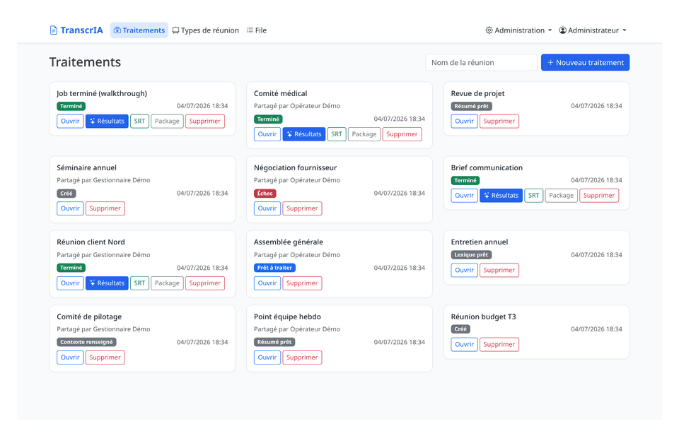
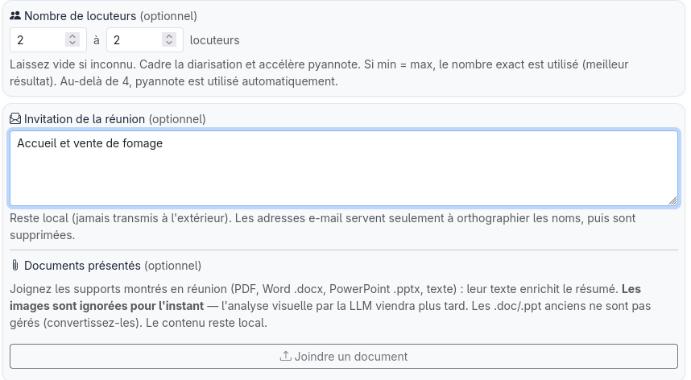
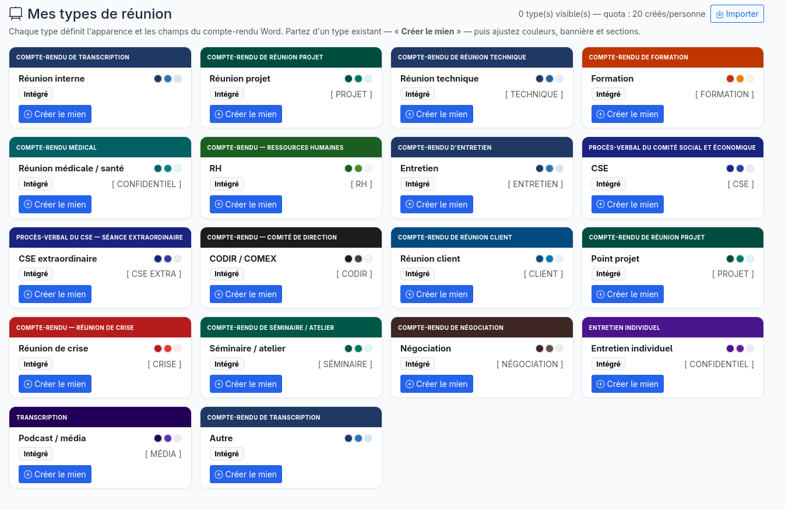
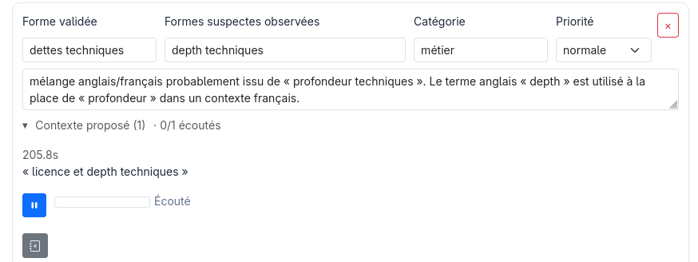
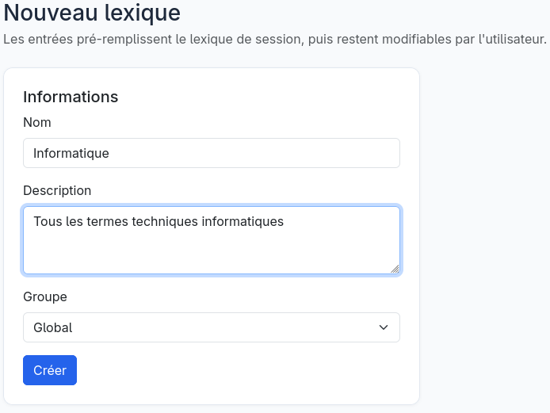

# TranscrIA

[](https://github.com/Martossien/transcria/actions/workflows/tests.yml)
[](LICENSE)
[](https://www.python.org/)
[](docs/INSTALL.md)
[](https://huggingface.co/spaces/martossien/transcria-audio-preflight)

*English version: [README.md](README.md).*

**Essayez tout de suite, sans installation :** la [démo de pré-vol audio](https://huggingface.co/spaces/martossien/transcria-audio-preflight)
exécute l'analyse « cet enregistrement va-t-il bien se transcrire ? » de TranscrIA
**entièrement dans votre navigateur** (rien n'est envoyé — WebAssembly).

*L'interface, les livrables générés et l'installateur sont **bilingues français / anglais**
(choix de la langue à l'installation ou dans la barre de navigation ; défaut français).
Ajouter d'autres langues ne demande aucune refonte (repli français partout) — voir
[docs/I18N_MULTILANGUE.md](docs/I18N_MULTILANGUE.md).*

**Portail de transcription de réunion auto-hébergé.** TranscrIA transforme de longs
enregistrements de réunion en livrables exploitables, sur vos propres GPU : transcriptions
corrigées et attribuées aux locuteurs (SRT), synthèses structurées, rapports qualité et
comptes rendus Word adaptés au type de réunion. Pas de cloud, pas de facturation à la
minute, souveraineté complète des données.

Il est conçu comme un **service** pour les équipes qui traitent de vraies réunions semaine
après semaine — pas comme une simple surcouche autour d'un modèle de transcription. Un
workflow guidé avec l'humain dans la boucle, une file GPU de production et un accès
multi-utilisateur par rôles sont au cœur du produit, pas des ajouts.



> **Lecteur non technique ?** (chef de projet, MOA, secrétaire de séance, DSI, décideur) —
> une présentation orientée métier existe : cas d'usage, bénéfices, exemples de résultats
> et parcours utilisateur, sans jargon → **[docs/PRESENTATION.md](docs/PRESENTATION.md)**.

## Statut du projet

**Version actuelle : 0.3.4** ([releases](https://github.com/Martossien/transcria/releases) ·
[changelog](CHANGELOG.md)). Le pipeline de transcription, l'assistant avec
validation humaine, la file GPU et sa planification, les exports, l'accès
multi-utilisateur, ainsi que les déploiements mono-machine et distribués sont validés de
bout en bout (suite unitaire et d'intégration, plus des passages sur GPU réel).

Jalons récents, du plus récent au plus ancien (tous dans la continuité de la ligne stable 0.2.0) :

| Version | Ce qu'elle apporte |
|---|---|
| **0.3.4** | **Moteurs STT & benchmarks** — moteurs mesurés sur de vraies réunions françaises contre référence humaine ([résultats publiés](docs/STT_BENCHMARK_REAL_MEETINGS.md)) ; nouveau backend Mistral Voxtral Mini 3B (Apache-2.0, meilleur WER mesuré) ; multi-STT ciblé **activé par défaut** (retranscription arbitrée des seuls segments dégradés — coût nul sur audio sain, best-effort) |
| **0.3.3** | Finitions — les dernières poches de français en interface anglaise fermées ; la langue des livrables suit désormais le choix d'interface |
| **0.3.2** | **Bilingue français / anglais de bout en bout** — interface web, livrables générés (compte-rendu, corrections, DOCX, rapports), installateur, `doctor`, PDF de consentement vocal. Le défaut reste le français ; l'anglais est un choix explicite (sélecteur dans la barre de navigation, préférence par utilisateur, langue des livrables par job, question à l'installation). Ajouter d'autres langues ne demande aucune refonte |
| **0.3.1** | Outillage opérateur — page admin *Maintenance* (créer, planifier, restaurer les sauvegardes) et page *Modèles* qui télécharge les modèles nécessaires à l'install |
| **0.3.0** | Ingestion des **documents présentés en réunion** (PDF / Word / PowerPoint) pour mieux ancrer le résumé et la correction du SRT |

La qualité de référence repose sur des modèles
sous conditions (voir [Prérequis](#prérequis) et [Limites connues](#limites-connues)).
Nous préférons énoncer les limites clairement plutôt que de laisser croire que l'outil
fait plus qu'il ne fait.

**Aller à :** [Ce que ça fait](#ce-que-ça-fait) · [Captures](#captures-décran) · [Conçu pour des équipes](#conçu-pour-des-équipes-pas-seulement-pour-des-runs) · [Profils](#profils-de-traitement) · [Comment ça marche](#comment-ça-marche) · [Installation](#installation) · [Déploiement](#topologies-de-déploiement) · [Limites connues](#limites-connues) · [Stack technique](#stack-technique) · [Documentation](#documentation)

## Ce que ça fait

- **Un vrai module audio, pas une surcouche `ffmpeg`.** Pré-vol acoustique (SNR, écrêtage,
  bande passante, drapeaux de risque), analyse de scène parole/musique/bruit, une frise de
  difficulté par fenêtre affichée *avant* la transcription, séparation de sources Demucs
  optionnelle, normalisation de niveau, VAD Silero — le tout coordonné avec la gestion
  GPU/VRAM.
- **L'humain dans la boucle là où ça compte.** Les locuteurs détectés arrivent avec des
  extraits audio jouables, leur temps de parole et un indice acoustique de genre ;
  l'utilisateur valide les noms, les participants et un lexique métier avant la passe
  finale. La reconnaissance de voix connues est soumise au consentement (formulaire signé,
  preuve hachée, audio source supprimé par défaut).
- **Arbitrage LLM sous garde-fous.** Une LLM locale compatible OpenAI produit la synthèse
  structurée, corrige le SRT à partir du lexique et du contexte validés, et une passe de
  relecture finale harmonise les livrables — avec nettoyage anti-hallucination, sémantique
  « réessai puis échec explicite », et des prompts éditables dans l'interface admin. On peut
  encore mieux ancrer la synthèse en collant l'invitation de la réunion et en **joignant les
  documents présentés** (PDF, Word, PowerPoint) : leur texte est extrait pour donner à la LLM
  l'ordre du jour, la terminologie et la structure (les images sont différées à un futur
  support vision ; les e-mails sont retirés et les fichiers eux-mêmes ne sont jamais conservés).
- **Un éditeur de transcription intégré, pensé pour la vraie relecture.** Un atelier plein
  écran sur tout job terminé : texte cliquable-éditable avec pause audio automatique, forme
  d'onde réelle zoomable aux poignées de segment déplaçables (pics calculés serveur, fluide
  même sur 4 h), découpe au curseur, actions multi-sélection (fusionner / réattribuer /
  supprimer), écoute solo par locuteur, points qualité en liste à cocher, et trois filets
  de sécurité — annuler/rétablir, un brouillon serveur toutes les 5 s, et des versions
  restaurables explicites.
- **Discuter avec les livrables terminés.** Sur la page résultats d'un job terminé, on
  discute la transcription, la synthèse et les points qualité avec la LLM locale (réponses
  rapides en lecture seule), puis on **applique** une modification en un clic : un terme
  corrigé l'est **de façon cohérente sur tous les livrables** (synthèse, SRT, données
  structurées). Chaque application crée une version restaurable, et les exports sont
  régénérés au téléchargement pour toujours refléter le dernier état.
- **Orchestration de production.** File GPU persistante (priorités, vieillissement
  anti-famine, pause/reprise, démarrages programmés), admission consciente de la VRAM par
  phase restante du pipeline, planification GPU par calendrier, pipeline reprenable (un job
  ré-enfilé ne refait jamais le travail déjà fait), et des estimations de temps calibrées
  qui apprennent de vos propres traitements passés. « En attente de VRAM » est un état de
  premier plan, signalé aux admins — pas un échec silencieux.
- **Conformité dès la conception.** Multi-utilisateur RBAC (rôles, groupes), piste d'audit
  RGPD complète (acteur, IP, horodatage, filtrable et exportable), profils vocaux soumis au
  consentement, secrets tenus hors de la configuration versionnée.

## Captures d'écran

**Accueil — les jobs en un coup d'œil, téléchargement SRT / ZIP en un clic**


**Profils de traitement — choisissez le livrable sur un seul curseur juste après l'upload ; le portail présélectionne le profil le plus complet que votre matériel peut exécuter et masque les étapes inutiles**


**Analyse audio — un verdict honnête avant de dépenser du GPU : scores perceptifs SQUIM/DNSMOS, SNR, frise de difficulté au fil du temps, et estimation de temps calibrée. Un enregistrement dégradé est signalé « à surveiller », pas transcrit en bouillie en silence**


**Apportez les documents de la réunion — collez l'invitation et joignez les slides, l'ordre du jour ou la note de cadrage (PDF, Word, PowerPoint). Leur texte est extrait (images différées à une future vision LLM) et sert deux fois : il ancre le résumé dans l'ordre du jour et la terminologie réels, et il devient une référence d'orthographe pour que la correction rétablisse les entités nommées — p. ex. un nom de produit ou un sigle mal transcrit. Tout reste local ; les e-mails sont retirés et les fichiers eux-mêmes ne sont jamais conservés**



**Validation des locuteurs — écouter les extraits, nommer les locuteurs, indices acoustiques de genre, et rapprocher un locuteur détecté de votre base de voix enregistrées (soumise au consentement RGPD) en un clic**


**Configuration — matériel détecté, formulaires clairs, prompts LLM éditables dans l'appli, YAML complet pour les experts**


**Planification GPU et file — créneaux calendaires, file persistante avec priorités et temps d'attente estimés**


**Éditeur intégré — relire comme un document : clic sur une ligne pour corriger le texte (l'audio se met en pause pendant la frappe), renommer ou réattribuer un locuteur au même endroit, fusionner ou découper des segments. La frise place chaque locuteur sur une piste sur toute la réunion, avec une forme d'onde colorée par locuteur, cliquable pour aller à l'instant et déplaçable pour zoomer ; les pics calculés serveur restent fluides sur plusieurs heures**


**Modèles de compte-rendu Word — 18 types de réunion intégrés (CSE, comité de direction, revue de projet, crise, RH, négociation, et plus), chacun avec sa page de garde, sa pastille et ses champs structurés. Dupliquez-en un, ajustez palette / bannière / sections, ajoutez un logo, prévisualisez le DOCX en direct, puis partagez-le à un groupe ou transportez-le entre installations en JSON**



**Discuter avec vos livrables — posez une question sur la transcription, la synthèse ou les points qualité et obtenez une réponse rapide en lecture seule ; puis, quand une reformulation vous convient, appliquez-la en un clic. Une seule correction se propage de façon cohérente sur le SRT, la synthèse et le compte-rendu Word, chaque application est sauvegardée comme version restaurable et les exports sont régénérés au téléchargement**


**La correction humaine alimente le lexique — un terme suspect (ici « depth techniques », un franglais mal transcrit pour « dettes techniques ») arrive avec son extrait audio que vous pouvez écouter pour entendre ce qui a réellement été dit. Confirmez la bonne orthographe, la catégorie et la priorité, puis ajoutez-le au lexique en un clic : la correction LLM l'applique sur cette transcription et le réutilise sur les prochains traitements**



**Lexiques centraux — un glossaire partagé, à portée Global (toute l'installation) ou d'un groupe. Ses entrées pré-remplissent le lexique de session à chaque job, puis restent modifiables par réunion ; les gestionnaires les entretiennent, et un terme corrigé sur un job (ci-dessus) peut y être promu directement — pour que toute l'équipe écrive « Kubernetes » ou un acronyme interne de la même façon**



## Profils de traitement

Après l'upload, vous choisissez un *livrable* sur un seul curseur, au lieu d'un opaque
sélecteur rapide/qualité. Le portail grise les profils que votre matériel ne peut pas
exécuter, présélectionne le plus complet qui tient, puis n'exécute que les phases du
pipeline — et ne réserve que le GPU/LLM — dont le profil choisi a réellement besoin.

| Profil | Livrable | Pipeline |
|---|---|---|
| **SRT express** | Sous-titres simples | STT seul |
| **SRT avec locuteurs** | Sous-titres attribués aux locuteurs | STT + diarisation |
| **Word rapide** | Rapport Word basique | STT + synthèse |
| **Word structuré** | Word structuré (contexte, participants) | STT + diarisation + extraction LLM |
| **Word corrigé** | Word corrigé et enrichi | + correction LLM et relecture finale |
| **Dossier qualité complet** | Compte rendu complet avec fichier qualité | Pipeline complet + notation qualité |

Les comptes rendus Word s'adaptent à des types de réunion intégrés (comité social et
économique, comité de direction, revue de projet, cellule de crise, etc.), et les équipes
peuvent créer, thématiser et partager leurs propres types — voir
[docs/TYPES_REUNION_PERSONNALISES.md](docs/TYPES_REUNION_PERSONNALISES.md).

## Comment ça marche

```
upload -> diagnostic audio -> synthèse rapide (STT + LLM) -> contexte, participants,
  lexique (validation humaine) -> pipeline final :
  prétraitement -> transcription -> diarisation -> correction LLM -> relecture finale
  -> notation qualité -> exports (SRT, segments, rapport qualité, compte rendu DOCX, ZIP)
  -> page résultats : chat d'affinage (discuter / appliquer, versionné et restaurable)
```

- **Moteurs STT** (interchangeables) : Cohere transcribe (défaut), Whisper large-v3 /
  faster-whisper, Mistral Voxtral Mini 3B (Apache-2.0), IBM Granite Speech, NVIDIA
  Parakeet TDT (expérimental), et **Kroko-ASR — l'option sans GPU** : modèles Zipformer
  streaming par langue (~155 Mo) sur sherpa-onnx, au niveau de nos meilleurs moteurs GPU
  sur réunions réelles, **sur CPU seul**. Tous peuvent aussi être servis par un serveur
  distant compatible OpenAI (vLLM, SGLang) — et nous avons vérifié que de jeunes runtimes
  C++ comme [audio.cpp](https://github.com/0xShug0/audio.cpp) et
  [parakeet.cpp](https://github.com/mudler/parakeet.cpp) se branchent sur ce même
  endpoint distant **sans une ligne de code, configuration seule**, avec de très bonnes
  surprises en qualité comme en vitesse. Nous benchons tout cela sur de **vraies réunions
  françaises** contre une transcription humaine professionnelle — WER, détecteur de
  dérive en traduction, juge LLM multi-passes et lecture humaine des modes d'échec :
  [docs/STT_BENCHMARK_REAL_MEETINGS.md](docs/STT_BENCHMARK_REAL_MEETINGS.md) (anglais).
- **Moteurs de diarisation** : pyannote.audio (défaut) ou NVIDIA Sortformer via NeMo.
- **LLM d'arbitrage** : un serveur local compatible OpenAI (Ollama / llama.cpp / vLLM),
  sélectionné selon le matériel depuis un catalogue de paliers piloté par les données.

Chaque phase est jalonnée : un job ré-enfilé reprend à la première phase incomplète, même
sur un autre worker.

## Conçu pour des équipes, pas seulement pour des runs

L'essentiel du travail est dans ce qui entoure la transcription — ce dont on a besoin dès
que de vraies personnes partagent l'outil, semaine après semaine.

- **Rôles et groupes.** Quatre rôles (admin, manager, opérateur, lecteur) et des groupes
  avec leurs propres admins ; jobs, lexiques et types de réunion se partagent à un groupe
  ou à toute l'installation.
- **Lexiques centraux.** Des glossaires partagés, à portée de groupe, que les admins
  entretiennent et que les utilisateurs appliquent. Un terme validé sur un job peut être
  promu dans un lexique central, pour que toute l'organisation écrive « SIRET » ou un
  acronyme interne de la même façon la fois suivante.
- **Piste d'audit et protection des données.** Chaque action sensible est journalisée
  (acteur, IP, horodatage) dans une piste filtrable et exportable ; la rétention est
  configurable avec purge automatique, documentée pour un DPO dans
  [docs/AUDIT_DPO.md](docs/AUDIT_DPO.md).
- **Enrôlement vocal.** Reconnaissance de voix connues soumise au consentement : un
  formulaire signé et une preuve hachée sont exigés avant toute empreinte, et l'audio de
  référence est supprimé par défaut.
- **Sauvegarde, restauration et montée de version guidée — CLI ou interface admin.** Une page
  *Administration → Maintenance* crée, liste, télécharge et restaure les sauvegardes (la
  restauration passe par un one-shot privilégié qui arrête le service, restaure, puis redémarre)
  et installe une **sauvegarde planifiée** (timer systemd) ; les mêmes opérations plus une montée
  de version outillée (migrations) vivent sur la CLI `maintenance` — sur SQLite ou PostgreSQL.
- **Gestionnaire de modèles.** Une page *Administration → Modèles* montre les modèles nécessaires
  à cette install (palier LLM d'arbitrage selon la VRAM, STT, diarisation), vérifie l'espace disque
  et les télécharge avec une barre de progression — token HuggingFace géré pour les modèles *gated*
  (pyannote, Cohere), activation en un clic de la LLM servie. Aussi via `maintenance opencode-upgrade`.
- **Une configuration réellement gérable.** Un schéma classifié de 423 clés pilote une
  interface admin claire et une référence générée ; les secrets restent hors de la config
  versionnée, et un pré-vol `doctor` valide l'ensemble avant la mise en service.

## Installation

TranscrIA tourne sous Linux avec un GPU NVIDIA. Deux chemins, selon votre objectif.

### Recommandé — installer sur une machine GPU

L'installeur est le chemin fiable pour un vrai déploiement : il détecte vos GPU et CUDA,
monte l'environnement virtuel et le PyTorch assorti à CUDA, vous aide à choisir et
télécharger la LLM d'arbitrage adaptée à votre VRAM, et installe un service `systemd`.

```bash
git clone https://github.com/Martossien/transcria.git
cd transcria
./install.sh          # guidé : détection GPU/CUDA, venv, PyTorch, backend LLM, unité systemd
./start.sh            # migrations de base, puis démarrage du serveur -> http://localhost:7870
```

Une fois installé en service, gérez-le comme d'habitude (c'est ainsi qu'il tourne en
production) :

```bash
sudo systemctl enable --now transcria
sudo systemctl status transcria
```

Validez toute installation avec le pré-vol intégré — sans GPU, sans effet de bord :

```bash
venv/bin/python scripts/doctor.py            # config, schéma DB, serveur LLM, opencode, stockage
venv/bin/python scripts/doctor.py --strict   # les avertissements deviennent des échecs (gates)
```

Options, prérequis modèles et rôles distribués sont documentés dans
[docs/INSTALL.md](docs/INSTALL.md).

### Simplement évaluer — une commande Docker

L'image « bundled » embarque les modèles par défaut : ni token, ni téléchargement, et ça
fonctionne hors-ligne. Il vous faut seulement un GPU NVIDIA (compute capability 7.5 ou
plus récent, 12 Go de VRAM ou plus) avec accès GPU pour Docker.

```bash
scripts/docker_quickstart.sh --bundled       # essayer : modèles inclus, sans token
```

Détails de l'image, compromis slim/bundled, table de compatibilité GPU/VRAM et rollback
dans [docs/DOCKER.md](docs/DOCKER.md).

> **Première connexion :** ouvrez `http://localhost:7870` et connectez-vous avec `admin`
> et le mot de passe initial du `config.yaml` généré (`auth.first_admin_password`).
> Changez-le avant tout usage réel — c'est un placeholder, et un avertissement est journalisé
> tant qu'il reste à sa valeur par défaut.

## Topologies de déploiement

L'installeur prend un `--profile` qui choisit le rôle de chaque machine ; le même code et
le même schéma de configuration servent tous les rôles.


- **Tout-en-un** (`./install.sh --profile all-in-one`, le défaut) — une seule machine GPU
  fait l'UI web, l'ordonnanceur et l'inférence GPU in-process.
- **Frontale web + worker GPU** — une frontale sans GPU (`--profile web`) et un worker GPU
  (`--profile scheduler`) partagent une base PostgreSQL ; les fichiers de job sont
  répliqués **via la base** (aucun système de fichiers partagé à exploiter, intégrité
  vérifiée en sha256). Voir [docs/STOCKAGE_PARTAGE_JOBS.md](docs/STOCKAGE_PARTAGE_JOBS.md).
- **Serveur de ressources GPU distant** (`--profile resource-node`) — un nœud GPU **sans
  base applicative** qui sert STT, diarisation et empreinte vocale par HTTP avec autonomie
  VRAM (réutilisation, lancement à la demande, 503 explicite sous pression). Voir
  [docs/SERVICE_RESSOURCES_GPU.md](docs/SERVICE_RESSOURCES_GPU.md).

Ces mêmes rôles existent comme points d'entrée de conteneur pour Docker
([docs/DOCKER.md](docs/DOCKER.md)).

## Limites connues

Nous gardons cette liste honnête et à jour.

| Aspect | Limite | Comportement au-delà |
|---|---|---|
| Durée d'une réunion | Testé jusqu'à ~4 h 30 (≈ 3 000 segments) | L'éditeur et le pipeline restent fluides ; au-delà, non garanti |
| Taille d'un fichier | `security.max_upload_size_mb` (1 Go par défaut) | Message « fichier trop volumineux » (413), jamais d'erreur brute |
| Locuteurs (diarisation Sortformer) | ≤ 4 | Utiliser pyannote (sous conditions) au-delà |
| Langue de l'interface | Français / anglais | Bilingue (interface, livrables, installateur, doctor) ; autres langues sans refonte (repli français) |
| VRAM < 12 Go | Pas de LLM de synthèse/correction | Repli sur la transcription brute |
| Espace disque | Surveillé par `doctor` (< 10 Go = alerte, < 2 Go = échec) | Un disque plein fait échouer un job proprement et apparaît au diagnostic |
| Rétention | Traitements 365 j, audit 1095 j (configurable) | Purge automatique + commande `maintenance.cli purge` |

## Prérequis

- Linux, Python 3.11+, un GPU NVIDIA (compute capability 7.5 ou plus récent).
- PostgreSQL en production (SQLite est supporté pour le développement et les tests).
- La qualité de référence utilise des modèles sous conditions — Cohere STT et pyannote —
  qui exigent un token Hugging Face et l'acceptation des conditions de chaque modèle. Sans
  token, TranscrIA exécute quand même tout le workflow avec des moteurs libres (Whisper,
  NVIDIA Sortformer, une petite LLM d'arbitrage non soumise à conditions).

## Stack technique

| Couche | Technologie |
|---|---|
| Backend | Python 3.11+, Flask 3, SQLAlchemy + Alembic (PostgreSQL en production, SQLite en dev) |
| Service STT | vLLM / SGLang / tout serveur compatible OpenAI ; moteurs locaux |
| Diarisation et voix | pyannote.audio, NVIDIA NeMo (Sortformer), empreintes vocales locales |
| Phases LLM | [opencode](https://github.com/sst/opencode) pilotant une LLM locale compatible OpenAI — backend au choix (Ollama / llama.cpp / vLLM), choisi selon le matériel depuis un catalogue de profils piloté par les données ([docs/LLM_BACKENDS.md](docs/LLM_BACKENDS.md)) |
| Audio | ffmpeg/ffprobe, Demucs, Silero VAD, métriques qualité SQUIM / DNSMOS |
| Frontend | Jinja2 rendu serveur + Bootstrap 5, JS vanilla |
| Exports | python-docx (comptes rendus thématisés), SRT, JSON, package ZIP |

## Documentation

La documentation complète vit dans [`docs/`](docs/README.md) (en français). Quelques points
d'entrée :

- [docs/TESTERS.md](docs/TESTERS.md) — **tester TranscrIA** (en anglais) : à quoi s'attendre, le test fumée de 15 minutes, quoi rapporter
- [docs/INSTALL.md](docs/INSTALL.md) — installation, modèles, `systemd`, rôles distribués
- [docs/DOCKER.md](docs/DOCKER.md) — déploiement conteneurisé
- [docs/TECHNICAL.md](docs/TECHNICAL.md) — architecture, pipeline, API, base de données
- [docs/CONFIG_REFERENCE.md](docs/CONFIG_REFERENCE.md) — référence complète de `config.yaml`
- [docs/EXTERNAL_STT_RUNTIMES.md](docs/EXTERNAL_STT_RUNTIMES.md) — brancher des serveurs STT C++ externes (audio.cpp, parakeet.cpp), configuration seule

## Licence

Apache-2.0 — voir [LICENSE](LICENSE). Les composants tiers conservent leurs propres
licences ; voir [THIRD_PARTY_NOTICES.md](THIRD_PARTY_NOTICES.md). Politique de sécurité :
[SECURITY.md](SECURITY.md). Contribution : [CONTRIBUTING.md](CONTRIBUTING.md). Journal des
changements : [CHANGELOG.md](CHANGELOG.md).
