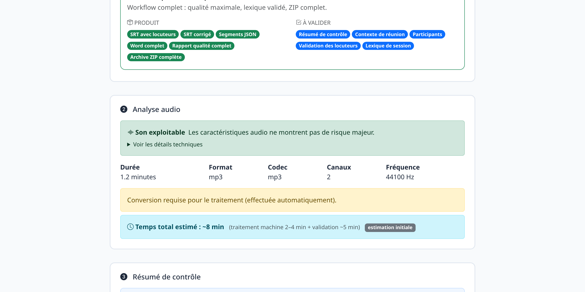
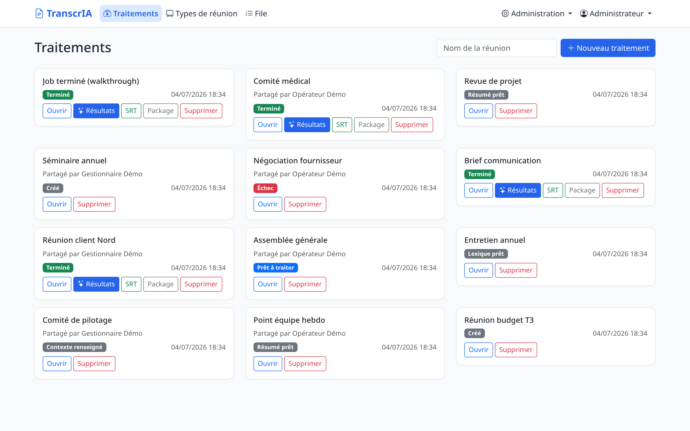
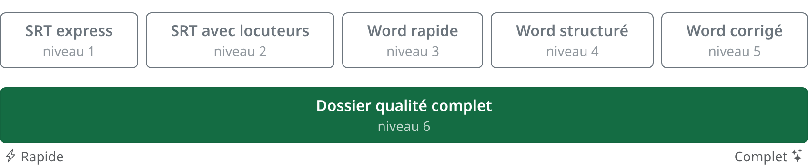
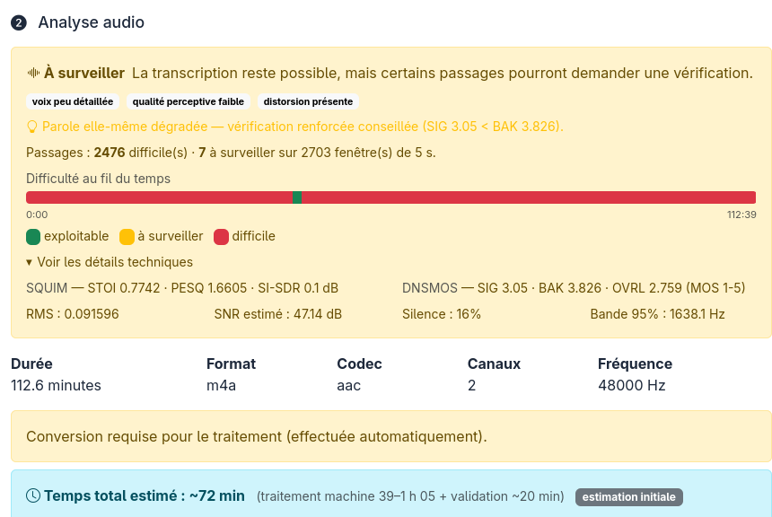
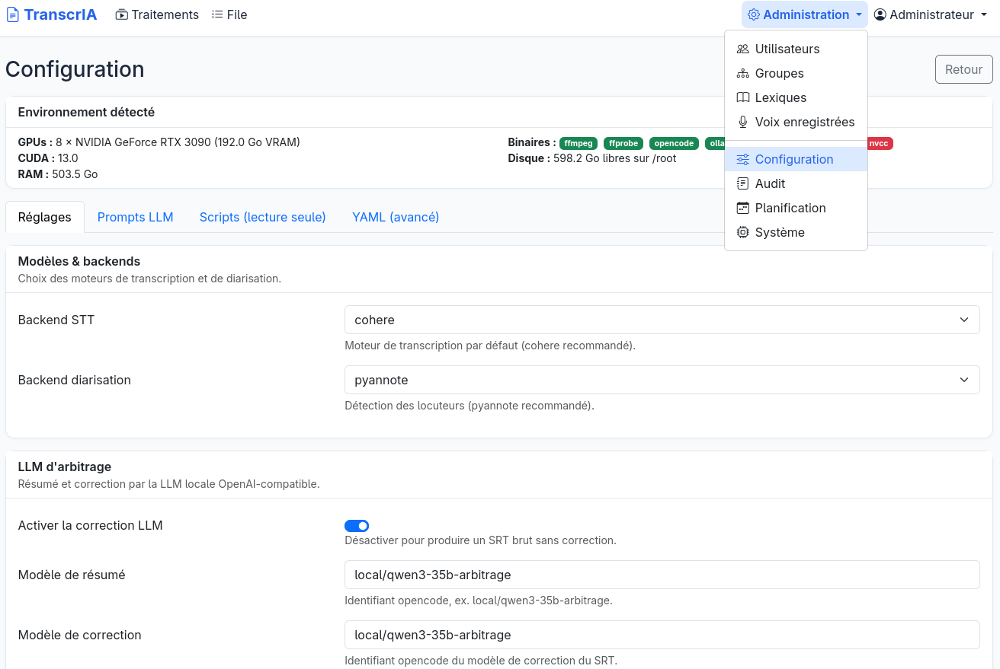
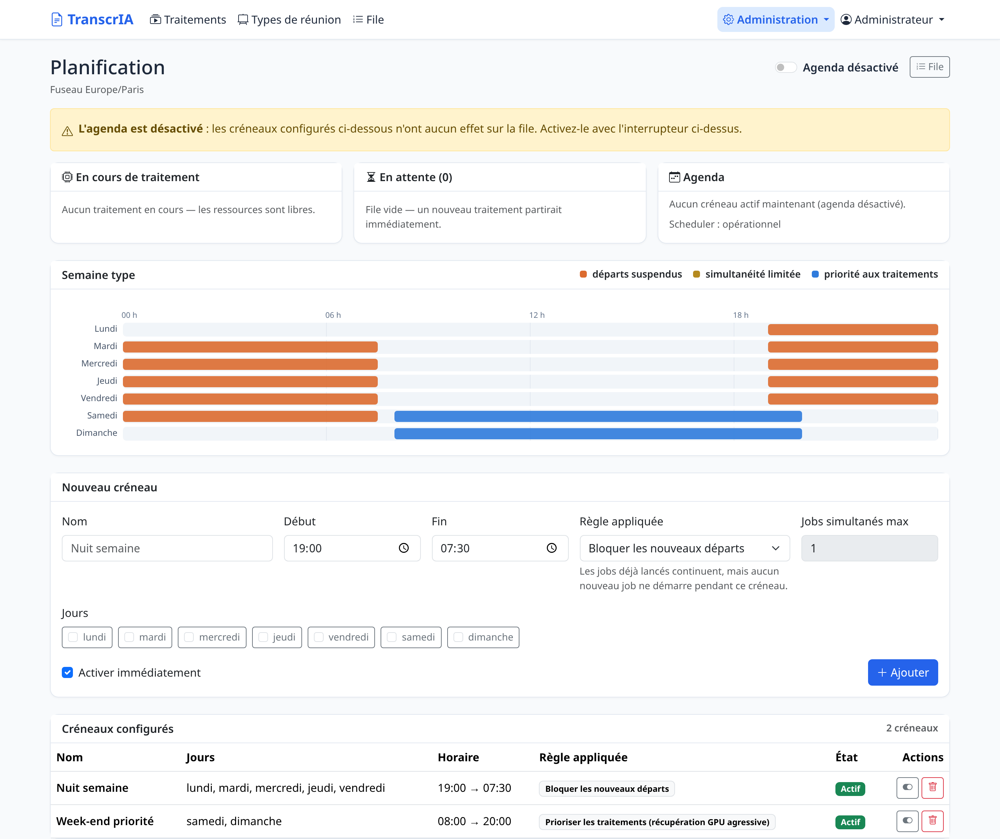
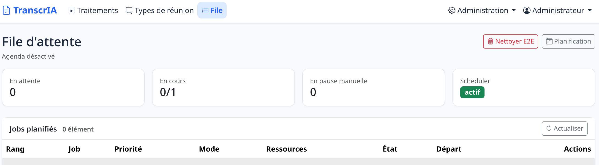
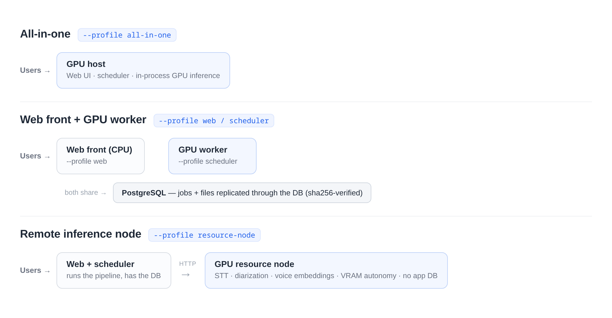

# TranscrIA

[](https://github.com/Martossien/transcria/actions/workflows/tests.yml)
[](LICENSE)
[](https://www.python.org/)
[](docs/INSTALL.md)

**Self-hosted meeting transcription portal.** TranscrIA turns long meeting recordings into
usable deliverables on your own GPUs: corrected, speaker-attributed transcripts (SRT),
structured summaries, quality reports, and meeting-type-aware Word minutes. No cloud, no
per-minute API bill, full data sovereignty.

It is built as a **service** for teams that process real meetings week after week — not as
a thin wrapper around a transcription model. A guided, human-in-the-loop workflow, a
production GPU queue, and role-based multi-user access are first-class, not afterthoughts.

*Interface and documentation are currently French-first — see [README français](README.fr.md).
UI strings and LLM prompts are centralized, so localization is a planned evolution rather
than a rewrite.*



## Project status — 0.2.0, first stable release

This is the first release TranscrIA considers **stable**. The transcription pipeline,
the human-in-the-loop wizard, the GPU queue and scheduler, exports, multi-user access,
and both the single-box and distributed deployments are validated end-to-end (unit and
integration suite plus real-GPU runs). The interface is French-first, and reference
quality relies on gated models (see [Requirements](#requirements) and
[Known limitations](#known-limitations)). We prefer to state limits plainly rather than
imply the tool does more than it does.

## What it does

- **A real audio module, not an `ffmpeg` wrapper.** Acoustic preflight (SNR, clipping,
  bandwidth, risk flags), speech/music/noise scene analysis, a per-window difficulty
  timeline shown *before* transcription, optional Demucs source separation, loudness
  normalization, and Silero VAD — all coordinated with GPU/VRAM management.
- **Human-in-the-loop where it matters.** Detected speakers come with playable audio
  excerpts, talk time, and an acoustic gender hint; users validate names, participants,
  and a domain lexicon before the final pass. Known-voice matching is consent-based
  (signed form, hashed proof, source audio deleted by default).
- **LLM arbitration with guardrails.** A local OpenAI-compatible LLM produces the
  structured summary, corrects the SRT using the validated lexicon and context, and a
  final review pass harmonizes the deliverables — with anti-hallucination cleanup,
  retry-then-fail-loud semantics, and prompts editable in the admin UI.
- **A built-in transcript editor made for real proofreading.** A full-screen workshop on
  any finished job: click-to-edit text with audio auto-pause, a zoomable real waveform
  with draggable segment handles (server-computed peaks, smooth even on 4-hour meetings),
  split-at-cursor, multi-select actions (merge / reassign / delete), solo-listen per
  speaker, quality findings as a clickable checklist, and three safety nets — undo/redo,
  a server-side draft every 5 seconds, and explicit restorable versions.
- **Chat with the finished deliverables.** On a completed job's results page, discuss the
  transcript, summary, and quality findings with the local LLM (fast, read-only answers),
  then apply a change in one click: a corrected term is fixed coherently across every
  deliverable (summary, SRT, structured data). Each apply snapshots a restorable version,
  and exports are regenerated at download so they always reflect the latest state.
- **Production-grade orchestration.** A persistent GPU job queue (priorities,
  anti-starvation aging, pause/resume, scheduled starts), VRAM-aware admission per
  remaining pipeline phase, calendar-based GPU scheduling, a resumable pipeline (a
  re-queued job never redoes finished work), and machine-calibrated time estimates that
  learn from your own past runs. "Waiting for VRAM" is a first-class, admin-alerted state,
  not a silent failure.
- **Compliance by design.** Multi-user RBAC (roles, groups), a full GDPR audit trail
  (actor, IP, timestamp, filterable and exportable), consent-gated voice profiles, and
  secrets kept out of the versioned configuration.

## Screenshots

**Home — jobs at a glance, one-click SRT / ZIP downloads**



**Processing profiles — pick your deliverable on a single slider right after upload; the portal pre-selects the most complete profile your hardware can run and hides the steps it doesn't need**



**Audio analysis — an honest verdict before you spend GPU time: SQUIM/DNSMOS perceptual scores, SNR, a per-window difficulty timeline, and a calibrated time estimate. A rough recording is flagged "watch this", not silently transcribed into mush**



**Speaker validation — listen to excerpts, name speakers, acoustic gender hints**


**Configuration — detected hardware, friendly forms, LLM prompts editable in-app, full YAML for experts**



**GPU scheduling and queue — calendar windows, persistent queue with priorities and estimated wait times**





**Built-in editor — proofread like a document: click any line to fix the text (audio auto-pauses while you type), rename or reassign a speaker in one place, merge or split segments. The timeline puts every speaker on a lane over the whole meeting, with a per-speaker colored waveform you click to jump and drag to zoom; server-computed peaks keep it smooth on multi-hour recordings**


## Processing profiles

After upload, you choose a *deliverable* on a single slider instead of an opaque
fast/quality switch. The portal greys out profiles your hardware cannot run, pre-selects
the most complete one that fits, and then executes only the pipeline phases — and reserves
only the GPU/LLM — that the chosen profile actually needs.

| Profile | Deliverable | Pipeline |
|---|---|---|
| **SRT express** | Plain subtitles | STT only |
| **SRT with speakers** | Speaker-attributed subtitles | STT + diarization |
| **Word rapide** | Basic Word report | STT + summary |
| **Word structuré** | Structured Word (context, participants) | STT + diarization + LLM extraction |
| **Word corrigé** | Corrected, enriched Word | + LLM correction and final review |
| **Dossier qualité complet** | Full minutes with quality file | Complete pipeline + quality scoring |

Word minutes adapt to built-in meeting types (works council, executive committee, project
review, crisis, and more), and teams can create, theme, and share their own types — see
[docs/TYPES_REUNION_PERSONNALISES.md](docs/TYPES_REUNION_PERSONNALISES.md).

## How it works

```
upload -> audio diagnosis -> quick summary (STT + LLM) -> context, participants,
  lexicon (human validation) -> final pipeline:
  preprocess -> transcription -> diarization -> LLM correction -> final review
  -> quality scoring -> exports (SRT, segments, quality report, DOCX minutes, ZIP)
  -> results page: refine chat (discuss / apply, versioned and restorable)
```

- **STT backends** (interchangeable): Cohere transcribe (default), Whisper large-v3 /
  faster-whisper, IBM Granite Speech, NVIDIA Parakeet TDT (experimental) — served locally
  or by a remote OpenAI-compatible server (vLLM, SGLang).
- **Diarization backends**: pyannote.audio (default) or NVIDIA Sortformer via NeMo.
- **Arbitration LLM**: a local OpenAI-compatible server (Ollama / llama.cpp / vLLM),
  selected per hardware from a data-driven tier catalog.

Every phase is checkpointed: a re-dispatched job resumes at the first incomplete phase,
even on a different worker.

## Built for teams, not just for runs

Most of the work went into the parts *around* the transcription — the things you need
once real people share the tool week after week.

- **Roles and groups.** Four roles (admin, manager, operator, viewer) and groups with
  their own admins; jobs, lexicons, and meeting types can be shared to a group or to the
  whole install.
- **Central lexicons.** Shared, group-scoped glossaries that admins curate and users
  apply. A term validated on one job can be promoted into a central lexicon, so the whole
  organization spells "SIRET" or an internal acronym the same way next time.
- **Audit trail and data protection.** Every sensitive action is logged (actor, IP,
  timestamp) in a filterable, exportable trail; retention is configurable with an
  automatic purge, documented for a DPO in [docs/AUDIT_DPO.md](docs/AUDIT_DPO.md).
- **Voice enrollment.** Consent-gated known-voice matching: a signed form and a hashed
  proof are required before any embedding is generated, and reference audio is deleted by
  default.
- **Backup, restore, and guided upgrade.** A maintenance CLI backs up the database and
  job files, restores them, and walks an upgrade through its migrations — on SQLite or
  PostgreSQL.
- **Configuration you can actually manage.** A classified 423-key schema drives a friendly
  admin UI and a generated reference; secrets stay out of the versioned config, and a
  `doctor` preflight validates the whole thing before you go live.

## Installation

TranscrIA runs on Linux with an NVIDIA GPU. Two paths, depending on your goal.

### Recommended — install on a GPU host

The installer is the reliable path for a real deployment: it detects your GPUs and CUDA,
sets up the virtual environment and CUDA-matched PyTorch, helps you pick and download the
arbitration LLM that best fits your VRAM, and installs a `systemd` service.

```bash
git clone https://github.com/Martossien/transcria.git
cd transcria
./install.sh          # guided: GPU/CUDA detection, venv, PyTorch, LLM backend, systemd unit
./start.sh            # database migrations, then start the server -> http://localhost:7870
```

Once installed as a service, manage it the usual way (this is how it runs in production):

```bash
sudo systemctl enable --now transcria
sudo systemctl status transcria
```

Validate any install with the built-in preflight — no GPU needed, no side effects:

```bash
venv/bin/python scripts/doctor.py            # config, DB schema, LLM server, opencode, storage
venv/bin/python scripts/doctor.py --strict   # warnings become failures (for deployment gates)
```

Options, model prerequisites, and distributed roles are documented in
[docs/INSTALL.md](docs/INSTALL.md).

### Just evaluating — one Docker command

The bundled image ships with default models baked in, so there is no token, no download,
and it works offline. You only need an NVIDIA GPU (compute capability 7.5 or newer, 12 GB
VRAM or more) with Docker GPU access.

```bash
scripts/docker_quickstart.sh --bundled       # try it: models included, no token
```

Image details, the slim-vs-bundled trade-off, the GPU/VRAM compatibility table, and
rollback are in [docs/DOCKER.md](docs/DOCKER.md).

> **First login:** open `http://localhost:7870` and sign in with `admin` and the initial
> password from the generated `config.yaml` (`auth.first_admin_password`). Change it
> before any real use — it is a placeholder, and a warning is logged while it stays at its
> default.

## Deployment topologies

The installer takes a `--profile` that selects the role each machine plays; the same
codebase and configuration schema serve all of them.



- **All-in-one** (`./install.sh --profile all-in-one`, the default) — a single GPU box
  runs the web UI, the scheduler, and in-process GPU inference.
- **Web frontend + GPU worker** — a CPU-only front (`--profile web`, "frontale") and a
  GPU worker (`--profile scheduler`) share a PostgreSQL database; job files are replicated
  through the database (no shared filesystem to operate, sha256-verified). See
  [docs/STOCKAGE_PARTAGE_JOBS.md](docs/STOCKAGE_PARTAGE_JOBS.md).
- **Remote inference node** (`--profile resource-node`) — a GPU resource server that runs
  no application database and serves STT, diarization, and voice embedding over HTTP with
  VRAM autonomy (reuse, launch on demand, explicit 503 under pressure). See
  [docs/SERVICE_RESSOURCES_GPU.md](docs/SERVICE_RESSOURCES_GPU.md).

The same roles exist as container entrypoints for Docker deployments
([docs/DOCKER.md](docs/DOCKER.md)).

## Known limitations

We keep this list honest and current.

| Area | Limit | Behaviour beyond it |
|---|---|---|
| Meeting length | Tested to about 4h30 (~3,000 segments) | Editor and pipeline stay responsive; beyond that is not guaranteed |
| Upload size | `security.max_upload_size_mb` (1 GB default) | A clear "file too large" (413), never a raw error |
| Speakers (Sortformer diarization) | Up to 4 | Use pyannote (gated) for more |
| Interface language | French-first | Strings and prompts are centralized; other locales are a planned evolution |
| Below 12 GB VRAM | No summary/correction LLM | Falls back to raw transcription |
| Disk space | Monitored by `doctor` (< 10 GB warns, < 2 GB fails) | A full disk fails a job cleanly and surfaces in diagnostics |
| Retention | Jobs 365 days, audit 1095 days (configurable) | Automatic purge plus a `maintenance.cli purge` command |

## Requirements

- Linux, Python 3.11+, an NVIDIA GPU (compute capability 7.5 or newer).
- PostgreSQL in production (SQLite is supported for development and tests).
- Reference quality uses gated models — Cohere STT and pyannote — which require a Hugging
  Face token and accepting each model's conditions. Without a token, TranscrIA still runs
  the full workflow using non-gated engines (Whisper, NVIDIA Sortformer, a small
  non-gated arbitration LLM).

## Tech stack

| Layer | Technology |
|---|---|
| Backend | Python 3.11+, Flask 3, SQLAlchemy + Alembic (PostgreSQL in production, SQLite for dev) |
| STT serving | vLLM / SGLang / any OpenAI-compatible server; local engines |
| Diarization and voice | pyannote.audio, NVIDIA NeMo (Sortformer), local voice embeddings |
| LLM phases | [opencode](https://github.com/sst/opencode) driving a local OpenAI-compatible LLM — selectable backend (Ollama / llama.cpp / vLLM), chosen per hardware from a data-driven profile catalog ([docs/LLM_BACKENDS.md](docs/LLM_BACKENDS.md)) |
| Audio | ffmpeg/ffprobe, Demucs, Silero VAD, SQUIM / DNSMOS quality metrics |
| Frontend | Server-rendered Jinja2 + Bootstrap 5, vanilla JS |
| Exports | python-docx (themed minutes), SRT, JSON, ZIP package |

## Documentation

Full documentation lives in [`docs/`](docs/README.md) (French). A few entry points:

- [docs/INSTALL.md](docs/INSTALL.md) — installation, models, `systemd`, distributed roles
- [docs/DOCKER.md](docs/DOCKER.md) — containerized deployment
- [docs/TECHNICAL.md](docs/TECHNICAL.md) — architecture, pipeline, API, database
- [docs/CONFIG_REFERENCE.md](docs/CONFIG_REFERENCE.md) — complete `config.yaml` reference

## License

Apache-2.0 — see [LICENSE](LICENSE). Third-party components retain their own licenses; see
[THIRD_PARTY_NOTICES.md](THIRD_PARTY_NOTICES.md). Security policy: [SECURITY.md](SECURITY.md).
Contributing: [CONTRIBUTING.md](CONTRIBUTING.md). Changes: [CHANGELOG.md](CHANGELOG.md).
