# TranscrIA

[](https://github.com/Martossien/transcria/actions/workflows/tests.yml)
[](LICENSE)
[](https://www.python.org/)
[](docs/INSTALL.md)
[](https://huggingface.co/spaces/martossien/transcria-audio-preflight)

**Try it right now, no install:** the [audio preflight demo](https://huggingface.co/spaces/martossien/transcria-audio-preflight)
runs TranscrIA's "will this recording transcribe well?" analysis **entirely in your browser**
(nothing is uploaded — WebAssembly).

**Self-hosted meeting transcription portal.** TranscrIA turns long meeting recordings into
usable deliverables on your own GPUs: corrected, speaker-attributed transcripts (SRT),
structured summaries, quality reports, and meeting-type-aware Word minutes. No cloud, no
per-minute API bill, full data sovereignty.

It is built as a **service** for teams that process real meetings week after week — not as
a thin wrapper around a transcription model. A guided, human-in-the-loop workflow, a
production GPU queue, and role-based multi-user access are first-class, not afterthoughts.

*The interface, the generated deliverables and the installer are **bilingual French / English**
(pick the language at install time or from the navbar; default French). See also
[README français](README.fr.md). Adding more languages needs no rewrite (French fallback
everywhere) — see [docs/I18N_MULTILANGUE.md](docs/I18N_MULTILANGUE.md).*

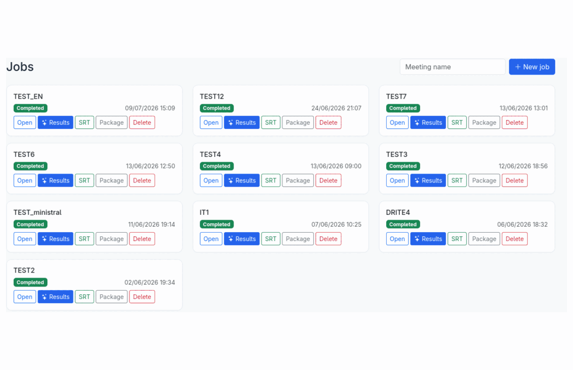

> **Non-technical reader?** (project manager, business owner, decision maker) — a
> business-oriented overview exists: use cases, benefits, example results and the user
> journey, no jargon → **[docs/PRESENTATION.en.md](docs/PRESENTATION.en.md)**
> ([version française](docs/PRESENTATION.md)).

## Project status

**Current release: 0.3.8.1** ([releases](https://github.com/Martossien/transcria/releases) ·
[changelog](CHANGELOG.md)). The transcription pipeline, the human-in-the-loop wizard, the
GPU queue and scheduler, exports, multi-user access, and both single-box and distributed
deployments are validated end-to-end (unit and integration suite plus real-GPU runs).
Reference quality relies on gated models (see [Requirements](#requirements) and
[Known limitations](#known-limitations)). We prefer to state limits plainly rather than
imply the tool does more than it does.

Recent milestones, newest first (all on the 0.2.0 stable line):

| Version | What it brought |
|---|---|
| **0.3.8** | **Speed & operator experience** — served STT goes parallel: **multi-instance pools** (`extra_urls` + one-click plan on the new **`/admin/hardware`** page — real-meeting gains up to **3.7×** on a 2 h recording, single-GPU machines benefit too); summary **auto-starts at upload** (opt-in); a new one-pass **`srt_moss` profile** (transcription + speakers, zero wizard step, guarded against silent skips and truncation — short meetings); freshness guarantees for exports (stale-synthesis banner, always-fresh ZIP); `reset-admin-password` CLI; a **non-Latin drift guard** that clears qwen3asr for primary-backend use; safer defaults measured in production (persistent MOSS site, 120 s opencode watchdog grace) |
| **0.3.7** | **Quality & hardening** — the 15-wave code-quality campaign delivered end to end: layered architecture locked by CI ratchets, a single GPU probe and unified kill patterns, zero legacy install modules, a **generated API reference** with a marked scriptable contract (⭐ upload → process → status → download), and real concurrency/deployment bugs found and fixed along the way (concurrent-job LLM race, resource-node runtimes env, `audiocpp --with-model` paths) |
| **0.3.6** | **Served STT runtimes** — audio.cpp and parakeet.cpp become first-class engines: pinned installer builds, on-demand start before jobs (all-in-one and GPU-node topologies), per-engine health checks, VRAM admission, native fallback — qualified on the real-meeting benchmark (`qwen3asr` 0.421 WER, `nemotron` 0.492 at ~2 s/5-min window) |
| **0.3.5** | **New engines & smarter editor** — MOSS-Transcribe-Diarize backend (transcription + speakers + timestamps in one pass, best text WER of our benchmark) and Kroko-ASR, the **no-GPU** backend (155 MB per language, CPU only, matches our GPU engines on real meetings); after editing the SRT, the editor now offers a **quick DOCX** or an **LLM-updated synthesis** (proposed, never automatic, versioned) |
| **0.3.4** | **STT engines & benchmarks** — engines measured on real French meetings against a human reference ([published results](docs/STT_BENCHMARK_REAL_MEETINGS.md)); new Mistral Voxtral Mini 3B backend (Apache-2.0, best measured WER); targeted multi-STT **on by default** (arbitrated re-transcription of degraded segments only — zero cost on clean audio, best-effort) |
| **0.3.3** | Polish — the last French leftovers in the English UI closed; the deliverable language now follows the interface choice |
| **0.3.2** | **Bilingual French / English end to end** — web UI, generated deliverables (minutes, corrections, DOCX, reports), installer, `doctor`, voice-consent PDF. Default stays French; English is an explicit choice (navbar switcher, per-user preference, per-job deliverable language, install-time question). More languages need no refactor |
| **0.3.1** | Operator tooling — a *Maintenance* admin page (create, schedule, restore backups) and a *Models* page that downloads the models this install needs |
| **0.3.0** | Ingestion of the **documents presented in a meeting** (PDF / Word / PowerPoint) to ground both the summary and the SRT correction |

**Jump to:** [What it does](#what-it-does) · [Screenshots](#screenshots) · [Built for teams](#built-for-teams-not-just-for-runs) · [Processing profiles](#processing-profiles) · [How it works](#how-it-works) · [Installation](#installation) · [Deployment](#deployment-topologies) · [Known limitations](#known-limitations) · [Tech stack](#tech-stack) · [Documentation](#documentation)

## What it does

- **A real audio module, not an `ffmpeg` wrapper.** Acoustic preflight (SNR, clipping,
  bandwidth, risk flags), speech/music/noise scene analysis, a per-window difficulty
  timeline shown *before* transcription, optional Demucs source separation, loudness
  normalization, and Silero VAD — all coordinated with GPU/VRAM management.
- **Human-in-the-loop where it matters.** Detected speakers come with playable audio
  excerpts, talk time, and an acoustic gender hint; users validate names, participants,
  and a domain lexicon before the final pass. Known-voice matching is consent-based
  (signed form, hashed proof, source audio deleted by default).
- **LLM arbitration with guardrails.** A local OpenAI-compatible LLM produces the
  structured summary, corrects the SRT using the validated lexicon and context, and a
  final review pass harmonizes the deliverables — with anti-hallucination cleanup,
  retry-then-fail-loud semantics, and prompts editable in the admin UI. You can ground
  the summary further by pasting the meeting invitation and **attaching the documents
  presented** (PDF, Word, PowerPoint): their text is extracted to feed the agenda,
  terminology, and structure to the LLM (images are deferred to future vision support;
  emails are stripped and the files themselves are never stored).
- **A built-in transcript editor made for real proofreading.** A full-screen workshop on
  any finished job: click-to-edit text with audio auto-pause, a zoomable real waveform
  with draggable segment handles (server-computed peaks, smooth even on 4-hour meetings),
  split-at-cursor, multi-select actions (merge / reassign / delete), solo-listen per
  speaker, quality findings as a clickable checklist, and three safety nets — undo/redo,
  a server-side draft every 5 seconds, and explicit restorable versions.
- **Chat with the finished deliverables.** On a completed job's results page, discuss the
  transcript, summary, and quality findings with the local LLM (fast, read-only answers),
  then apply a change in one click: a corrected term is fixed coherently across every
  deliverable (summary, SRT, structured data). Each apply snapshots a restorable version,
  and exports are regenerated at download so they always reflect the latest state.
- **Production-grade orchestration.** A persistent GPU job queue (priorities,
  anti-starvation aging, pause/resume, scheduled starts), VRAM-aware admission per
  remaining pipeline phase, calendar-based GPU scheduling, a resumable pipeline (a
  re-queued job never redoes finished work), and machine-calibrated time estimates that
  learn from your own past runs. "Waiting for VRAM" is a first-class, admin-alerted state,
  not a silent failure.
- **Compliance by design.** Multi-user RBAC (roles, groups), a full GDPR audit trail
  (actor, IP, timestamp, filterable and exportable), consent-gated voice profiles, and
  secrets kept out of the versioned configuration.

## Screenshots

**Home — jobs at a glance, one-click SRT / ZIP downloads**

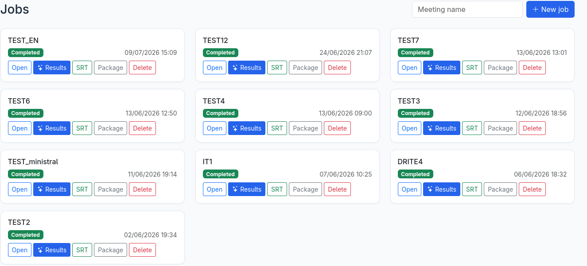

**Processing profiles — pick your deliverable on a single slider right after upload; the portal pre-selects the most complete profile your hardware can run and hides the steps it doesn't need**

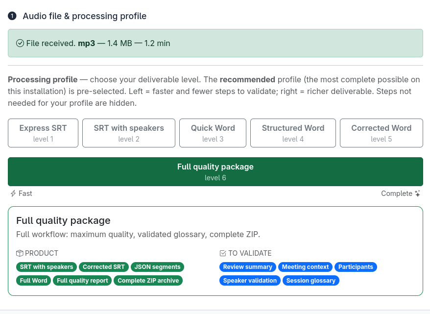

**Audio analysis — an honest verdict before you spend GPU time: SQUIM/DNSMOS perceptual scores, SNR, a per-window difficulty timeline, and a calibrated time estimate. A rough recording is flagged "needs attention", not silently transcribed into mush**

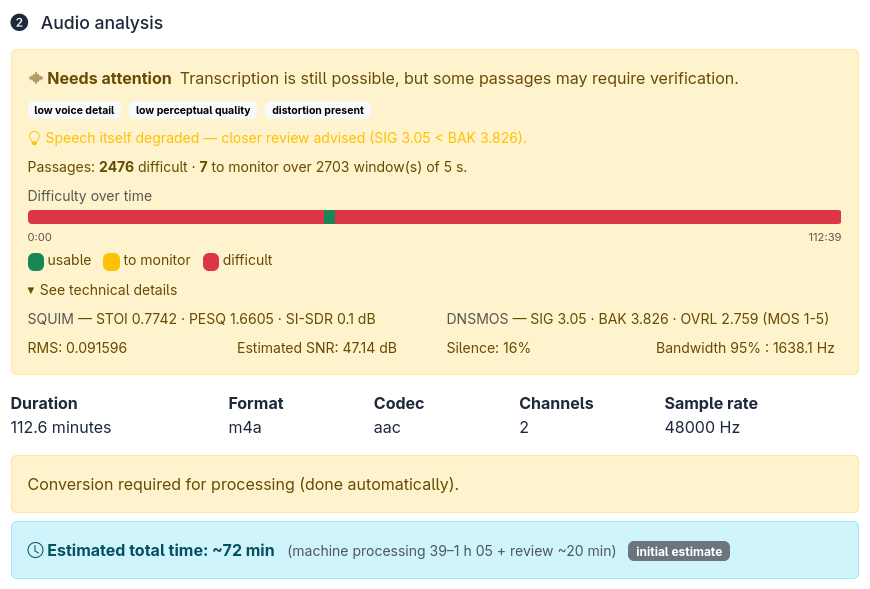

**Bring the meeting's own documents — paste the invitation and attach the slides, agenda or briefing note (PDF, Word, PowerPoint). Their text is extracted (images deferred to future LLM vision) and used two ways: it grounds the summary in the real agenda and terminology, and it becomes a spelling reference so the correction can fix named entities — e.g. a product name or an acronym wrongly transcribed. Everything stays local; emails are stripped and the files themselves are never stored**


**Speaker validation — listen to excerpts, name speakers, acoustic gender hints, and match a detected speaker against your consent-gated voice enrollment database (GDPR) in one click**

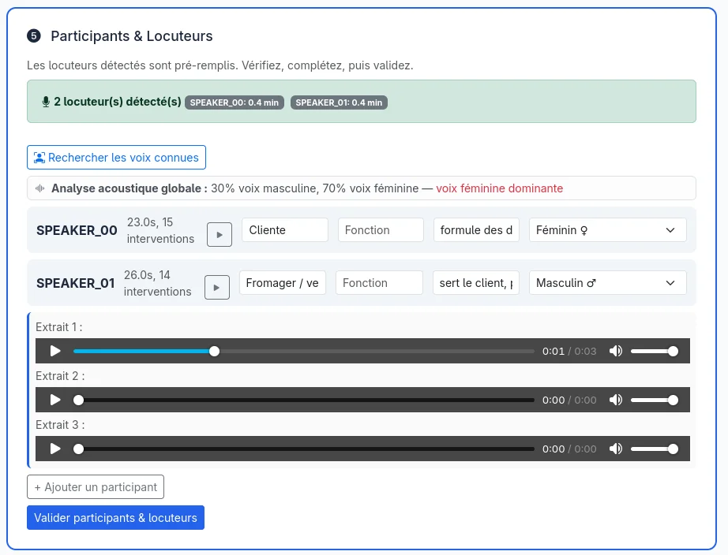

**Configuration — detected hardware, friendly forms, LLM prompts editable in-app, full YAML for experts**

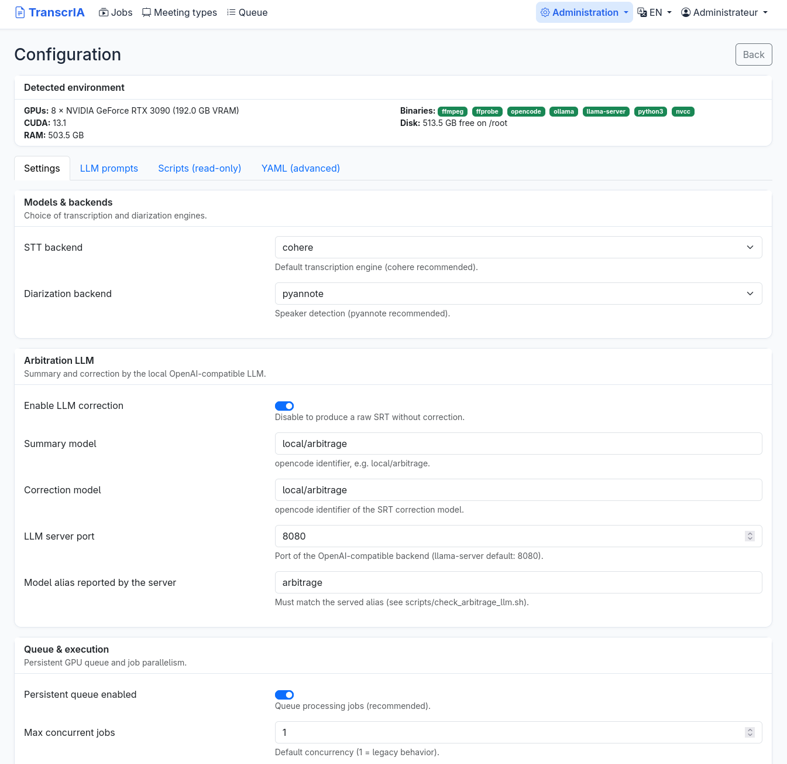

**GPU scheduling and queue — calendar windows, persistent queue with priorities and estimated wait times**


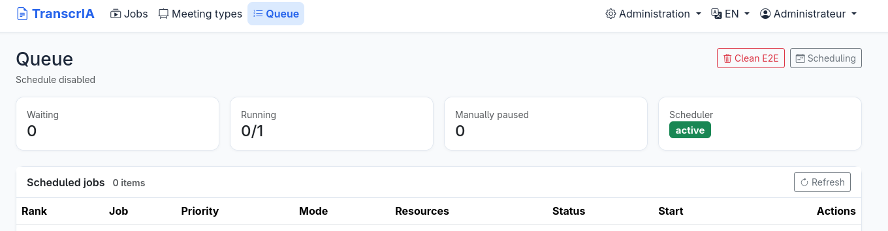

**Built-in editor — proofread like a document: click any line to fix the text (audio auto-pauses while you type), rename or reassign a speaker in one place, merge or split segments. The timeline puts every speaker on a lane over the whole meeting, with a per-speaker colored waveform you click to jump and drag to zoom; server-computed peaks keep it smooth on multi-hour recordings**

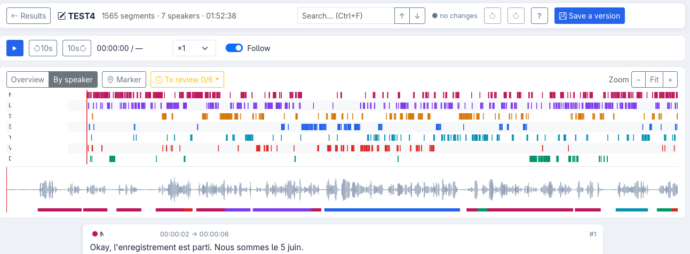

**Word report templates — 18 built-in meeting types (works council, executive committee, project review, crisis, HR, negotiation, and more), each with its own cover theme, badge, and structured fields. Duplicate one, adjust palette / banner / sections, add a logo, preview the DOCX live, then share it to a group or carry it between installs as JSON**

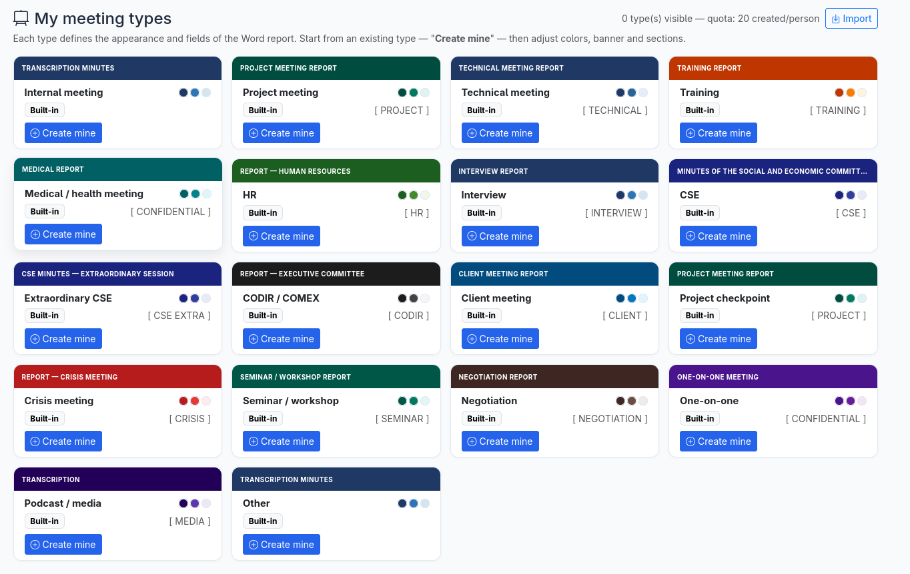

**Chat with your deliverables — ask a question about the transcript, summary or quality findings and get a fast, read-only answer; then, when a rewrite suits you, apply it in one click. A single fix propagates coherently across the SRT, the summary and the Word minutes, each apply saved as a restorable version and the exports regenerated on download**

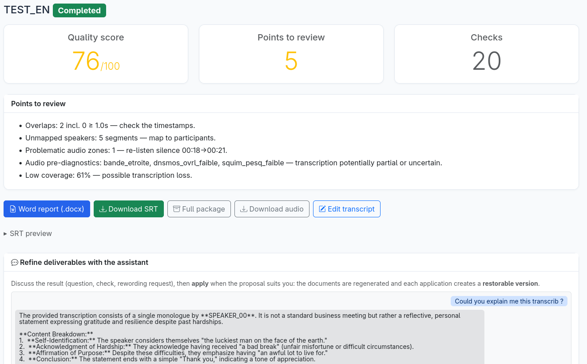

**Human correction feeds the lexicon — a suspect term (here "nominaton", an STT mis-spelling of "nomination") comes with the audio excerpt you can play to hear what was actually said. Confirm the correct spelling, set a category and priority, then add it to the lexicon in one click: the LLM correction applies it across this transcript and reuses it on future jobs**

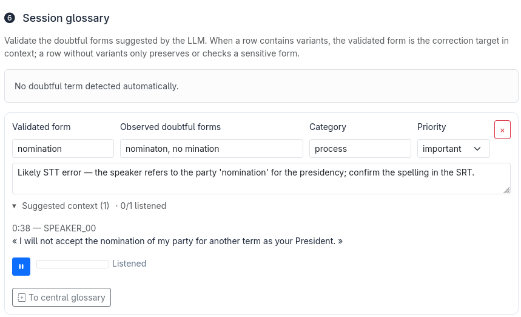

**Central lexicons — a shared glossary scoped either Global (the whole install) or to a single group. Its entries pre-fill the session lexicon on every job, then stay editable per meeting; managers curate them, and a term corrected on one job (above) can be promoted straight into one — so the whole team spells "Kubernetes" or an internal acronym the same way**

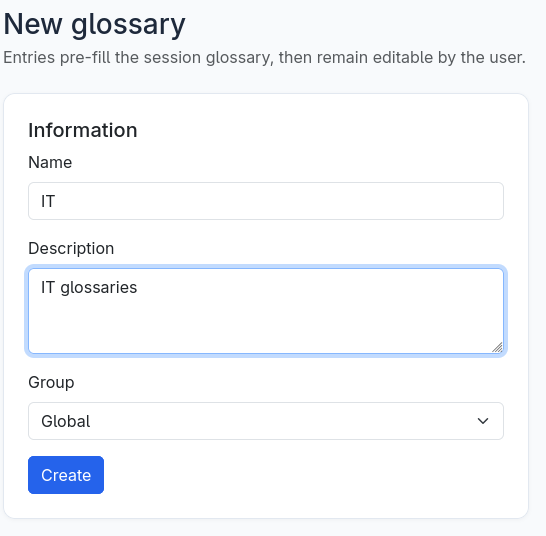

## Processing profiles

After upload, you choose a *deliverable* on a single slider instead of an opaque
fast/quality switch. The portal greys out profiles your hardware cannot run, pre-selects
the most complete one that fits, and then executes only the pipeline phases — and reserves
only the GPU/LLM — that the chosen profile actually needs.

| Profile | Deliverable | Pipeline |
|---|---|---|
| **Express SRT** | Plain subtitles | STT only |
| **SRT with speakers** | Speaker-attributed subtitles | STT + diarization |
| **Single-pass speaker SRT (MOSS)** | Speaker-attributed subtitles, zero wizard step | One MOSS pass (opt-in, short meetings — guarded against silent skips) |
| **Quick Word** | Basic Word report | STT + summary |
| **Structured Word** | Structured Word (context, participants) | STT + diarization + LLM extraction |
| **Corrected Word** | Corrected, enriched Word | + LLM correction and final review |
| **Full quality package** | Full minutes with quality file | Complete pipeline + quality scoring |

Word minutes adapt to built-in meeting types (works council, executive committee, project
review, crisis, and more), and teams can create, theme, and share their own types — see
[docs/TYPES_REUNION_PERSONNALISES.md](docs/TYPES_REUNION_PERSONNALISES.md).

## How it works

```
upload -> audio diagnosis -> quick summary (STT + LLM) -> context, participants,
  lexicon (human validation) -> final pipeline:
  preprocess -> transcription -> diarization -> LLM correction -> final review
  -> quality scoring -> exports (SRT, segments, quality report, DOCX minutes, ZIP)
  -> results page: refine chat (discuss / apply, versioned and restorable)
```

- **STT backends** (interchangeable): Cohere transcribe (default), Whisper large-v3 /
  faster-whisper, Mistral Voxtral Mini 3B (Apache-2.0), IBM Granite Speech, NVIDIA
  Parakeet TDT (experimental), **MOSS-Transcribe-Diarize** (experimental — transcription,
  speaker labels and fine timestamps in a single pass; best text WER of our benchmark),
  and **Kroko-ASR — the no-GPU option**: per-language
  streaming Zipformer models (~155 MB) on sherpa-onnx that matched our best GPU engines
  on real meetings, **CPU only**. All can also be served by a remote OpenAI-compatible
  server (vLLM, SGLang). Going further, two **C++ serving runtimes are first-class
  engines**: [audio.cpp](https://github.com/0xShug0/audio.cpp) (`qwen3asr` —
  Qwen3-ASR-1.7B, 2nd-best WER of our whole benchmark) and
  [parakeet.cpp](https://github.com/mudler/parakeet.cpp) (`nemotron` — ~2 s per 5-minute
  window). TranscrIA installs them pinned (one command each), **starts them on demand
  before jobs**, health-checks and stops them — the same lifecycle discipline as the
  local arbitration LLM (see [docs/EXTERNAL_STT_RUNTIMES.md](docs/EXTERNAL_STT_RUNTIMES.md)). We benchmark everything on **real French meeting recordings** against a
  professional human transcript — WER, an English-drift detector, a multi-run LLM judge
  and human reading of the failure modes:
  [docs/STT_BENCHMARK_REAL_MEETINGS.md](docs/STT_BENCHMARK_REAL_MEETINGS.md) (English).
- **Diarization backends**: pyannote.audio (default) or NVIDIA Sortformer via NeMo.
- **Arbitration LLM**: a local OpenAI-compatible server (Ollama / llama.cpp / vLLM),
  selected per hardware from a benchmarked VRAM tier catalog (12 → 64 GB, one validated
  model + quant + context per tier) — see [docs/LLM_TIERS.md](docs/LLM_TIERS.md) (English).

Every phase is checkpointed: a re-dispatched job resumes at the first incomplete phase,
even on a different worker.

## Built for teams, not just for runs

Most of the work went into the parts *around* the transcription — the things you need
once real people share the tool week after week.

- **Roles and groups.** Four roles (admin, manager, operator, viewer) and groups with
  their own admins; jobs, lexicons, and meeting types can be shared to a group or to the
  whole install.
- **Enterprise identity (SSO).** Optional single sign-on through OIDC (Keycloak, Entra
  ID…), an authentication proxy (Authelia, oauth2-proxy), or LDAP / Active Directory
  directly — with just-in-time provisioning and group-to-role mapping, configurable from
  the admin UI. Personal API tokens let scripts drive the stable API. Local accounts stay
  the default and a break-glass local login is always available
  ([docs/GESTION_IDENTITE.md](docs/GESTION_IDENTITE.md)).
- **Central lexicons.** Shared, group-scoped glossaries that admins curate and users
  apply. A term validated on one job can be promoted into a central lexicon, so the whole
  organization spells "SIRET" or an internal acronym the same way next time.
- **Audit trail and data protection.** Every sensitive action is logged (actor, IP,
  timestamp) in a filterable, exportable trail; retention is configurable with an
  automatic purge, documented for a DPO in [docs/AUDIT_DPO.md](docs/AUDIT_DPO.md).
- **Voice enrollment.** Consent-gated known-voice matching: a signed form and a hashed
  proof are required before any embedding is generated, and reference audio is deleted by
  default.
- **Backup, restore, and guided upgrade — CLI or admin UI.** An *Administration → Maintenance*
  page creates, lists, downloads and restores backups (restore runs a privileged one-shot that
  stops the service, restores, and restarts) and installs a **scheduled backup** (systemd timer);
  the same operations plus a tooled, migration-aware upgrade live on the `maintenance` CLI — on
  SQLite or PostgreSQL.
- **Model manager.** An *Administration → Models* page shows which models this install needs
  (arbitration-LLM tier for the detected VRAM, STT, diarization), checks free disk, and downloads
  them with a progress bar — HuggingFace token handled for gated models (pyannote, Cohere),
  one-click activation of the served LLM. Also on the `maintenance opencode-upgrade` CLI.
- **Configuration you can actually manage.** A classified 423-key schema drives a friendly
  admin UI and a generated reference; secrets stay out of the versioned config, and a
  `doctor` preflight validates the whole thing before you go live.

## Installation

TranscrIA runs on Linux with an NVIDIA GPU. Two paths, depending on your goal.

### Recommended — install on a GPU host

The installer is the reliable path for a real deployment: it detects your GPUs and CUDA,
sets up the virtual environment and CUDA-matched PyTorch, helps you pick and download the
arbitration LLM that best fits your VRAM, and installs a `systemd` service.

```bash
git clone https://github.com/Martossien/transcria.git
cd transcria
./install.sh          # guided: GPU/CUDA detection, venv, PyTorch, LLM backend, systemd unit
./start.sh            # database migrations, then start the server -> http://localhost:7870
```

Once installed as a service, manage it the usual way (this is how it runs in production):

```bash
sudo systemctl enable --now transcria
sudo systemctl status transcria
```

Validate any install with the built-in preflight — no GPU needed, no side effects:

```bash
venv/bin/python scripts/doctor.py            # config, DB schema, LLM server, opencode, storage
venv/bin/python scripts/doctor.py --strict   # warnings become failures (for deployment gates)
```

Options, model prerequisites, and distributed roles are documented in
[docs/INSTALL.md](docs/INSTALL.md).

### Just evaluating — one Docker command

The bundled image ships with default models baked in, so there is no token, no download,
and it works offline. You only need an NVIDIA GPU (compute capability 7.5 or newer, 12 GB
VRAM or more) with Docker GPU access.

```bash
scripts/docker_quickstart.sh --bundled       # try it: models included, no token
```

Image details, the slim-vs-bundled trade-off, the GPU/VRAM compatibility table, and
rollback are in [docs/DOCKER.md](docs/DOCKER.md).

> **First login:** open `http://localhost:7870` and sign in with `admin` and the initial
> password from the generated `config.yaml` (`auth.first_admin_password`). Change it
> before any real use — it is a placeholder, and a warning is logged while it stays at its
> default.

## Deployment topologies

The installer takes a `--profile` that selects the role each machine plays; the same
codebase and configuration schema serve all of them.

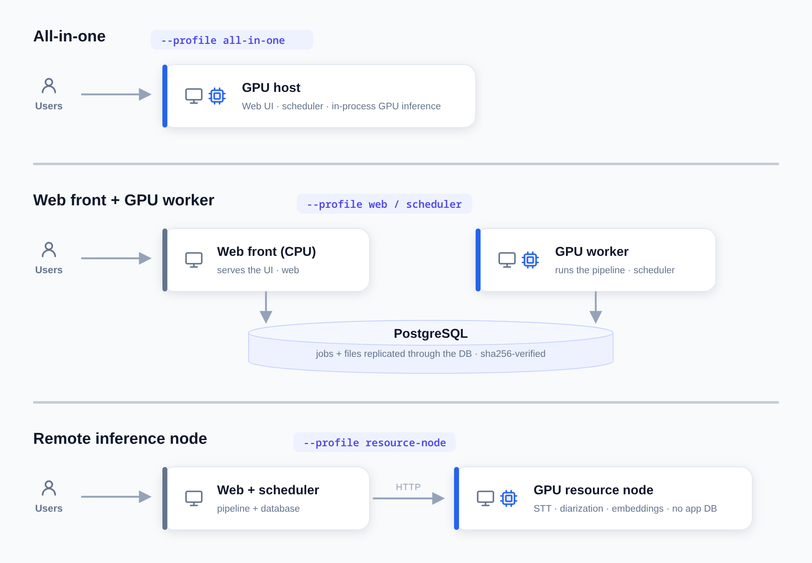

- **All-in-one** (`./install.sh --profile all-in-one`, the default) — a single GPU box
  runs the web UI, the scheduler, and in-process GPU inference.
- **Web frontend + GPU worker** — a CPU-only front (`--profile web`, "frontale") and a
  GPU worker (`--profile scheduler`) share a PostgreSQL database; job files are replicated
  through the database (no shared filesystem to operate, sha256-verified). See
  [docs/STOCKAGE_PARTAGE_JOBS.md](docs/STOCKAGE_PARTAGE_JOBS.md).
- **Remote inference node** (`--profile resource-node`) — a GPU resource server that runs
  no application database and serves STT, diarization, and voice embedding over HTTP with
  VRAM autonomy (reuse, launch on demand, explicit 503 under pressure). See
  [docs/SERVICE_RESSOURCES_GPU.md](docs/SERVICE_RESSOURCES_GPU.md).

The same roles exist as container entrypoints for Docker deployments
([docs/DOCKER.md](docs/DOCKER.md)).

## Known limitations

We keep this list honest and current.

| Area | Limit | Behaviour beyond it |
|---|---|---|
| Meeting length | Tested to about 4h30 (~3,000 segments) | Editor and pipeline stay responsive; beyond that is not guaranteed |
| Upload size | `security.max_upload_size_mb` (1 GB default) | A clear "file too large" (413), never a raw error |
| Speakers (Sortformer diarization) | Up to 4 | Use pyannote (gated) for more |
| Interface language | French / English | Bilingual (UI, deliverables, installer, doctor); more languages need no rewrite (French fallback) |
| Below 12 GB VRAM | No summary/correction LLM | Falls back to raw transcription |
| Disk space | Monitored by `doctor` (< 10 GB warns, < 2 GB fails) | A full disk fails a job cleanly and surfaces in diagnostics |
| Retention | Jobs 365 days, audit 1095 days (configurable) | Automatic purge plus a `maintenance.cli purge` command |

## Requirements

- Linux, Python 3.11+, an NVIDIA GPU (compute capability 7.5 or newer).
- PostgreSQL in production (SQLite is supported for development and tests).
- Reference quality uses gated models — Cohere STT and pyannote — which require a Hugging
  Face token and accepting each model's conditions. Without a token, TranscrIA still runs
  the full workflow using non-gated engines (Whisper, NVIDIA Sortformer, a small
  non-gated arbitration LLM).

## Tech stack

| Layer | Technology |
|---|---|
| Backend | Python 3.11+, Flask 3, SQLAlchemy + Alembic (PostgreSQL in production, SQLite for dev) |
| STT serving | vLLM / SGLang / any OpenAI-compatible server; local engines |
| Diarization and voice | pyannote.audio, NVIDIA NeMo (Sortformer), local voice embeddings |
| LLM phases | [opencode](https://github.com/sst/opencode) driving a local OpenAI-compatible LLM — selectable backend (Ollama / llama.cpp / vLLM), chosen per hardware from a benchmarked VRAM tier catalog ([docs/LLM_TIERS.md](docs/LLM_TIERS.md), English) |
| Audio | ffmpeg/ffprobe, Demucs, Silero VAD, SQUIM / DNSMOS quality metrics |
| Frontend | Server-rendered Jinja2 + Bootstrap 5, vanilla JS |
| Exports | python-docx (themed minutes), SRT, JSON, ZIP package |

## Documentation

Full documentation lives in [`docs/`](docs/README.md) (French). A few entry points:

- [docs/TESTERS.md](docs/TESTERS.md) — **testing TranscrIA**: what to expect, the 15-minute smoke test, what to report
- [docs/INSTALL.md](docs/INSTALL.md) — installation, models, `systemd`, distributed roles
- [docs/DOCKER.md](docs/DOCKER.md) — containerized deployment
- [docs/TECHNICAL.md](docs/TECHNICAL.md) — architecture, pipeline, API, database
- [docs/CONFIG_REFERENCE.md](docs/CONFIG_REFERENCE.md) — complete `config.yaml` reference
- [docs/EXTERNAL_STT_RUNTIMES.md](docs/EXTERNAL_STT_RUNTIMES.md) — plugging external C++ STT servers (audio.cpp, parakeet.cpp), configuration only

## License

Apache-2.0 — see [LICENSE](LICENSE). Third-party components retain their own licenses; see
[THIRD_PARTY_NOTICES.md](THIRD_PARTY_NOTICES.md). Security policy: [SECURITY.md](SECURITY.md).
Contributing: [CONTRIBUTING.md](CONTRIBUTING.md). Changes: [CHANGELOG.md](CHANGELOG.md).
