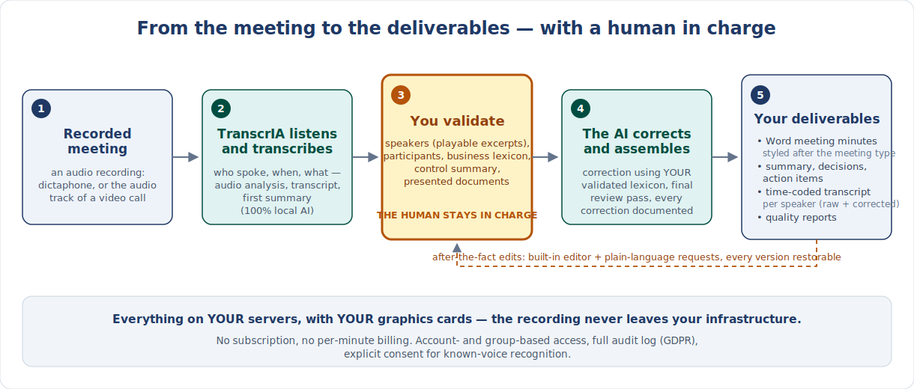

# TranscrIA for business readers — use cases, benefits, user journey

> 🇫🇷 [Version française](PRESENTATION.md)

> This page is written for **non-technical readers**: project managers, business owners,
> meeting secretaries, compliance officers, decision makers. No jargon, no command line —
> the technical entry point (installation, architecture) remains the
> [repository README](../README.md).

**In one sentence:** TranscrIA turns a meeting recording into working documents —
Word minutes, a structured summary with decisions and action items, a transcript
attributed to each speaker — **on your organisation's own servers**, with no data ever
leaving them, and **without ever publishing a document nobody has proofread**.

## The journey in one picture

## Who it is for

| You are… | Your problem | What TranscrIA changes |
|---|---|---|
| **Meeting secretary, committee assistant** (works councils, boards, committees) | Hours spent writing faithful minutes from notes or a recording | A complete, time-coded draft right after the meeting: who said what, summary, decisions — what remains is proofreading, not typing |
| **Project manager, PMO** | Decisions and action items get lost between two meetings | The *Decisions made* and *Action items* sections are extracted, then **reviewed by you** before anything is circulated |
| **Executive team, HR, negotiations** | Conversations that simply cannot go through an online service | Nothing leaves your infrastructure; account- and group-based access, full audit log |
| **IT department, compliance officer** | SaaS transcription tools are incompatible with your data policy | Self-hosted, open source (Apache-2.0 licence), GDPR audit log, explicit consent for voice recognition, configurable retention |
| **Team with specialised vocabulary** (technical, medical, legal) | Automatic transcription butchers your acronyms and proper names | **Shared lexicons** per team pre-fill every meeting, and a term corrected once can be promoted for the whole team |

## Concrete use cases

TranscrIA ships with **18 built-in meeting types**, each with its own Word minutes
template (cover page, colours, type-specific fields) — and your teams can create their
own:

- **Works council (CSE) and extraordinary sessions** — chair and meeting secretary,
  attendees / quorum, reference to the previous minutes: the fields of formal committee
  minutes are there out of the box.
- **Project review, project check-in** — project name, phase/milestone, sprint;
  decisions and action items brought forward.
- **Executive committee, crisis meeting, negotiation** — leadership vocabulary, agenda
  and blocking points brought forward.
- **HR meeting, one-on-one, medical meeting** — marked **confidential** by default.
- **Training session, seminar, workshop** — trainer, number of participants, venue.
- **Client meeting** — client name, contract reference.
- **Interview, podcast / media…** — plus an "Other" type for everything else.

## What you get

At the end of a run, you download:

- **Word minutes ready for proofreading** — a cover page styled after the meeting type,
  then the expected sections: context, summary, participants with speaking time, agenda,
  **decisions made**, **action items**, blocking points.
- **A structured summary** that you reviewed and could edit *before* generation.
- **The full transcript, time-coded and attributed to each speaker** — in both the raw
  **and** the corrected version, with a report listing every correction made: for
  high-stakes meetings, you can always go back to what was actually said.
- **Quality reports**: doubtful passages are flagged instead of being papered over.

And afterwards, two retouching tools without leaving the application:

| | |
|---|---|
|  | **You name the voices.** Every detected speaker comes with playable audio excerpts and their speaking time — you are the one deciding that "Speaker 2" is Ms Martin. |
|  | **A built-in editor** to fix the transcript with your mouse, audio side by side with the text and restorable versions — no export to a third-party tool. |
|  | **Ask for a change in plain language** ("rephrase decision 2"): the correction propagates consistently to the transcript, the summary and the Word minutes. |

## You stay in charge — the user journey

The heart of the product: **the AI proposes, the human validates**. The guided journey
has up to nine steps — the profile chosen at step 1 determines which ones are needed:

1. **Upload the recording** and pick a processing profile;
2. **Audio analysis** — the application tells you *before processing* whether the
   recording is usable (and why, minute by minute);
3. **Control summary** — a first summary to check that the machine understood the
   meeting; you can **attach the documents that were presented** (agenda, PDF / Word /
   PowerPoint slides) to anchor everything downstream;
4. **Meeting context** — type, type-specific fields (quorum, project, client…);
5. **Participants and speakers** — name the voices, excerpts at hand;
6. **Session lexicon** — acronyms and proper names, pre-filled from your team's
   lexicons;
7. **Final processing** — AI correction and harmonisation, using *your* lexicon;
8. **Quality control** — points to double-check, flagged explicitly;
9. **Export** — Word, transcript, full archive.

From fastest to most thorough, **six profiles** dose the effort: *Express SRT* (the raw
transcript, as fast as possible, no validation), *SRT with speakers*, *Quick Word*,
*Structured Word*, *Corrected Word*, all the way to the *Full quality package* (every
validation, every report). An informal stand-up does not deserve the same care as a
board meeting — the choice is one click, right when you drop the file.

## The expected benefits

- **Cost control** — no subscription, no per-audio-minute billing: the tool runs on a
  server with a graphics card, including already-amortised hardware. The marginal cost
  of one more meeting is electricity.
- **Confidentiality and data sovereignty** — the recording, the transcript and the
  minutes never leave your infrastructure. No account with any third party.
- **Compliance, with the tooling to prove it** — full audit log (who did what, when,
  filterable and exportable), configurable retention, known-voice recognition subject to
  signed consent. Enough to document the processing for your data-protection officer.
- **Quality controlled, not promised** — every automated step has its human checkpoint
  and its trace: the raw version kept next to the corrected one, every AI correction
  documented, doubtful passages flagged.
- **Team capitalisation** — shared lexicons, minutes templates per meeting type, groups
  with their own administrators: the second meeting costs less effort than the first,
  and the tool improves as the team uses it.
- **Enterprise identity (0.3.9)** — sign in through your existing directory: OIDC SSO
  (Keycloak, Entra ID…), an authentication proxy (Authelia, oauth2-proxy) or LDAP /
  Active Directory directly, with automatic role assignment from group membership.
  Personal API tokens allow automation without sharing a password. Every sign-in is
  audited; a break-glass local login always remains. Users sign in with their usual
  credentials, IT keeps control.
- **Bilingual** — interface and deliverables in French or English, each user's choice.

## What TranscrIA is not

Let's be upfront:

- **Not a bot that joins your video calls.** It starts from a recording (an audio
  file) — your dictaphone's, or the audio track exported from your video-conferencing
  tool.
- **Not real-time.** Processing happens after the meeting, in a few dozen minutes
  depending on duration and hardware.
- **Not a turnkey online service.** You need a server with a graphics card (from 12 GB
  of video memory) and a technical contact to install it — half a day's work with
  step-by-step guides, and that is the price of sovereignty over your data.
- **Not an infallible AI — by design.** Automatic transcription makes mistakes,
  especially on proper names. The whole product is built so that these errors are
  *seen and fixed* before anything is circulated, not hidden.

## Trying it out

- **No install at all:** the [audio preflight demo](https://huggingface.co/spaces/martossien/transcria-audio-preflight)
  runs entirely in your browser — will *your* meeting recordings transcribe well?
- **You have an IT department?** Hand them the [testers guide](TESTERS.md) (a 15-minute
  smoke test on a GPU machine) or the [Docker deployment](DOCKER.md) — one command is
  enough for an evaluation instance.
- **Questions, a use case to discuss?** [GitHub Discussions](https://github.com/Martossien/transcria/discussions)
  are open, in English as well as in French.
- **The product tour in pictures:** the [screenshot gallery](../README.md#screenshots)
  in the README.
