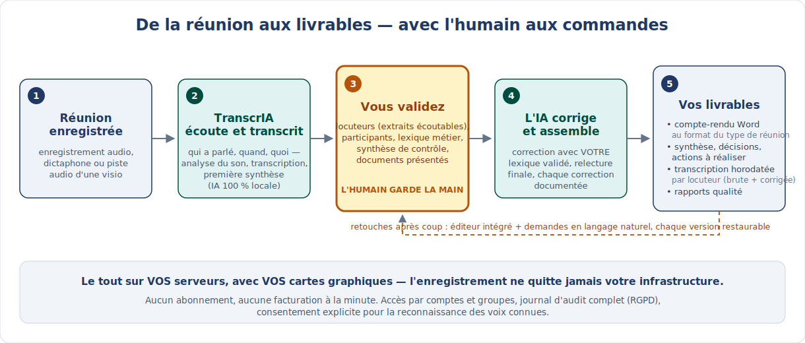
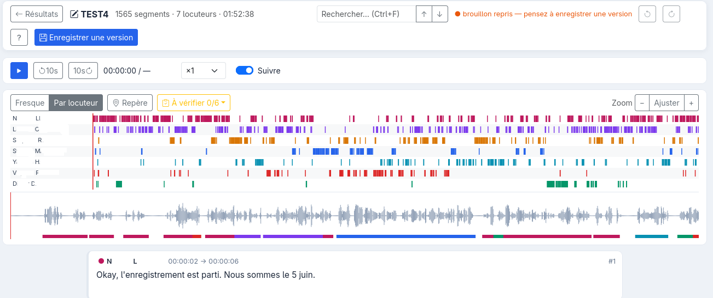
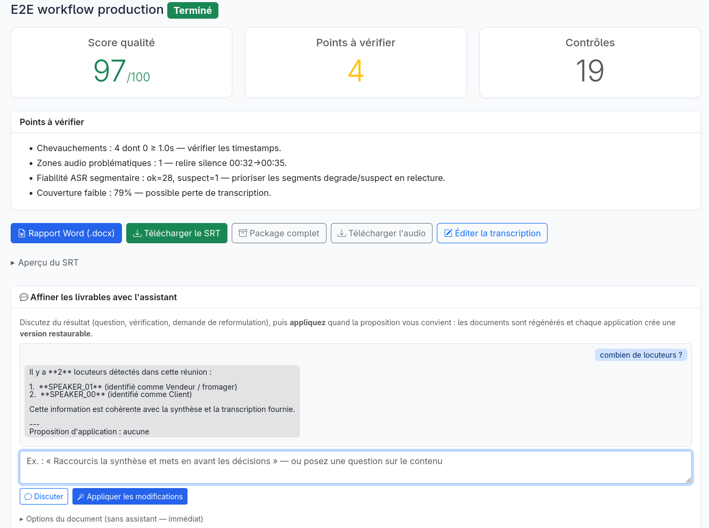

# TranscrIA côté métier — cas d'usage, bénéfices, parcours

> 🇬🇧 [English version](PRESENTATION.en.md)

> Cette page s'adresse aux lecteurs **non techniques** : chefs de projet, MOA, secrétaires
> de séance, responsables métier, DSI, décideurs. Pas de jargon, pas de ligne de commande —
> l'entrée technique (installation, architecture) reste le [README du dépôt](../README.fr.md).

**En une phrase :** TranscrIA transforme l'enregistrement d'une réunion en documents
exploitables — compte-rendu Word, synthèse avec décisions et actions, transcription
attribuée à chaque intervenant — **sur les serveurs de votre organisation**, sans
qu'aucune donnée n'en sorte, et **sans jamais publier un document que personne n'a relu**.

## Le parcours en une image

## À qui ça s'adresse

| Vous êtes… | Votre problème | Ce que TranscrIA change |
|---|---|---|
| **Secrétaire de séance, assistant·e d'instance** (CSE, conseils, comités) | Des heures à rédiger un PV fidèle à partir de notes ou d'un enregistrement | Une trame complète et horodatée en sortie de réunion : qui a dit quoi, synthèse, décisions — il reste la relecture, pas la saisie |
| **Chef de projet, PMO** | Les décisions et les actions se perdent entre deux réunions | Les sections *Décisions prises* et *Actions à réaliser* sont extraites, puis **relues par vous** avant diffusion |
| **Direction, RH, négociation** | Des échanges qui ne peuvent tout simplement pas transiter par un service en ligne | Rien ne sort de votre infrastructure ; accès par comptes et groupes, journal d'audit complet |
| **DSI, responsable conformité** | Les outils SaaS de transcription sont incompatibles avec votre politique de données | Auto-hébergé, code source ouvert (licence Apache-2.0), journal d'audit RGPD, consentement explicite pour la reconnaissance des voix, rétention paramétrable |
| **Équipe au vocabulaire pointu** (technique, médical, juridique) | La transcription automatique massacre vos acronymes et noms propres | Des **lexiques partagés** par équipe pré-remplissent chaque réunion, et un terme corrigé une fois peut être promu pour toute l'équipe |

## Des cas d'usage concrets

TranscrIA connaît **18 types de réunion intégrés**, chacun avec son modèle de
compte-rendu Word (page de garde, couleurs, champs propres au type) — et vos équipes
peuvent créer les leurs :

- **CSE et CSE extraordinaire** — président et secrétaire de séance, membres présents /
  quorum, référence au PV précédent : les champs d'un PV d'instance sont prévus d'origine.
- **Revue de projet, point projet** — nom du projet, phase/jalon, sprint ; décisions et
  actions mises en avant.
- **CODIR / COMEX, réunion de crise, négociation** — vocabulaire de direction, ordre du
  jour et points bloquants mis en avant.
- **RH, entretien individuel, réunion médicale** — marqués **confidentiels** d'origine.
- **Formation, séminaire, atelier** — formateur, nombre de participants, lieu.
- **Réunion client** — nom du client, référence contrat.
- **Entretien, podcast / média…** — et un type « Autre » pour tout le reste.

## Ce que vous obtenez

À la fin d'un traitement, vous téléchargez :

- **Un compte-rendu Word prêt à relire** — page de garde au format du type de réunion,
  puis les sections attendues : contexte, synthèse, participants et temps de parole,
  ordre du jour, **décisions prises**, **actions à réaliser**, points bloquants.
- **Une synthèse structurée** que vous avez relue et pu éditer *avant* la génération.
- **La transcription complète, horodatée et attribuée à chaque intervenant** — en version
  brute **et** corrigée, avec un rapport listant chaque correction apportée : pour les
  réunions à enjeux, on peut toujours revenir à ce qui a été réellement dit.
- **Des rapports de qualité** : les passages douteux sont signalés au lieu d'être maquillés.

Et après coup, deux outils de retouche sans quitter l'application :

| | |
|---|---|
|  | **Vous nommez les voix.** Chaque locuteur détecté vient avec des extraits audio écoutables et son temps de parole — c'est vous qui décidez que « Locuteur 2 » est Mme Martin. |
|  | **Un éditeur intégré** pour corriger la transcription à la souris, avec l'audio en face du texte et des versions restaurables — pas d'export vers un outil tiers. |
|  | **Demandez une retouche en français courant** (« reformule la décision 2 ») : la correction se propage de façon cohérente à la transcription, à la synthèse et au compte-rendu Word. |

## Vous gardez la main — le parcours utilisateur

Le point central du produit : **l'IA propose, l'humain valide**. Le parcours guidé
comporte jusqu'à neuf étapes — le profil choisi à l'étape 1 détermine lesquelles sont
nécessaires :

1. **Déposer l'enregistrement** et choisir un profil de traitement ;
2. **Analyse du son** — l'application dit *avant de traiter* si l'enregistrement est
   exploitable (et pourquoi, minute par minute) ;
3. **Résumé de contrôle** — une première synthèse pour vérifier que la machine a compris
   la réunion ; on peut y **joindre les documents présentés** (ordre du jour, slides PDF /
   Word / PowerPoint) pour ancrer la suite ;
4. **Contexte de la réunion** — type, champs propres au type (quorum, projet, client…) ;
5. **Participants et locuteurs** — nommer les voix, extraits à l'appui ;
6. **Lexique de session** — acronymes et noms propres, pré-remplis par les lexiques de
   l'équipe ;
7. **Traitement final** — correction et harmonisation par l'IA, avec *votre* lexique ;
8. **Contrôle qualité** — points à vérifier, signalés explicitement ;
9. **Export** — Word, transcription, archive complète.

Du plus rapide au plus soigné, **sept profils** dosent l'effort : *SRT express* (la
transcription brute, au plus vite, aucune validation), *SRT avec locuteurs*, *Word
rapide*, *Word structuré*, *Word corrigé*, jusqu'au *Dossier qualité complet* (toutes les
validations, tous les rapports). Une réunion informelle ne mérite pas le même soin qu'un
CSE — le choix se fait en un clic, au dépôt du fichier.

## Les bénéfices attendus

- **Maîtrise des coûts** — pas d'abonnement, pas de facturation à la minute d'audio :
  l'outil tourne sur un serveur équipé d'une carte graphique, y compris du matériel déjà
  amorti. Le coût marginal d'une réunion de plus est l'électricité.
- **Confidentialité et souveraineté** — l'enregistrement, la transcription et les
  comptes-rendus ne quittent jamais votre infrastructure. Aucun compte chez un tiers.
- **Conformité outillée** — journal d'audit complet (qui a fait quoi, quand, filtrable et
  exportable), rétention paramétrable, reconnaissance des voix connues soumise à un
  consentement signé. De quoi documenter le traitement auprès d'un DPO.
- **Qualité contrôlée, pas promise** — chaque automatisme a son point de contrôle humain
  et sa trace : version brute conservée à côté de la version corrigée, chaque correction
  de l'IA documentée, passages douteux signalés.
- **Capitalisation d'équipe** — lexiques partagés, modèles de compte-rendu par type de
  réunion, groupes avec leurs propres administrateurs : la deuxième réunion coûte moins
  d'effort que la première, et l'outil s'améliore avec l'usage de l'équipe.
- **Bilingue** — interface et livrables en français ou en anglais, au choix de chacun.

## Ce que TranscrIA n'est pas

Autant le dire clairement :

- **Pas un robot qui rejoint vos visioconférences.** On part d'un enregistrement
  (fichier audio) — celui de votre dictaphone ou la piste audio exportée de votre visio.
- **Pas du temps réel.** Le traitement se fait après la réunion, en quelques dizaines de
  minutes selon la durée et le matériel.
- **Pas un service en ligne clé en main.** Il faut un serveur avec une carte graphique
  (à partir de 12 Go de mémoire vidéo) et un interlocuteur technique pour l'installer —
  c'est l'affaire d'une demi-journée, guides pas à pas à l'appui, et c'est le prix de la
  souveraineté sur vos données.
- **Pas une IA infaillible — et c'est assumé.** La transcription automatique se trompe,
  surtout sur les noms propres. Tout le produit est construit pour que ces erreurs soient
  *vues et corrigées* avant diffusion, pas dissimulées.

## Pour essayer

- **Sans rien installer :** la [démo d'analyse du son](https://huggingface.co/spaces/martossien/transcria-audio-preflight)
  tourne entièrement dans votre navigateur — *vos* enregistrements de réunion se
  transcriront-ils bien ?
- **Vous avez une DSI ?** Transmettez-lui le [guide d'essai](TESTERS.md) (test en
  15 minutes sur une machine équipée) ou le [déploiement Docker](DOCKER.md) — une
  commande suffit pour une instance d'évaluation.
- **Des questions, un cas d'usage à discuter ?** Les
  [Discussions GitHub](https://github.com/Martossien/transcria/discussions) sont ouvertes,
  en français comme en anglais.
- **Le tour du produit en images :** la [galerie de captures d'écran](../README.fr.md#captures-décran)
  du README.
